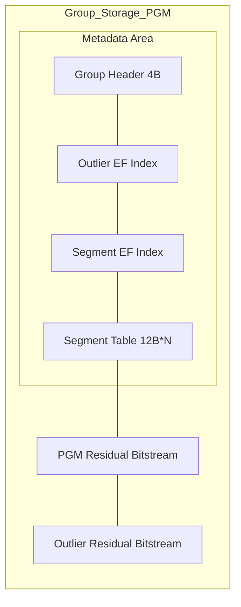
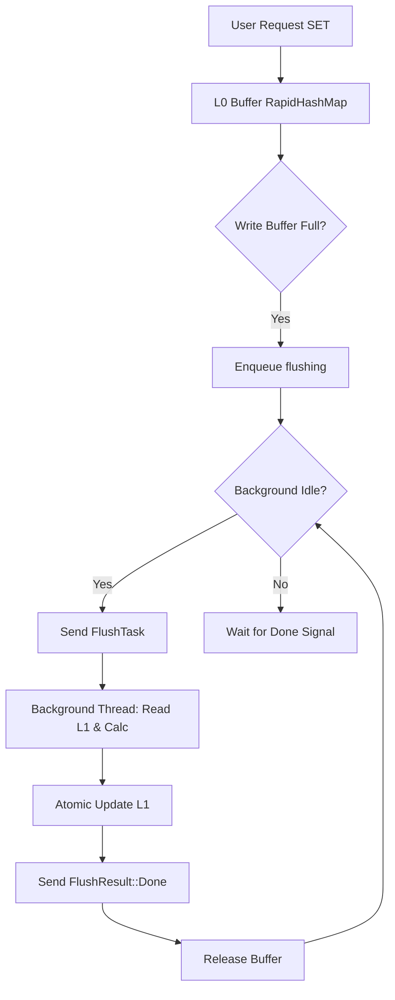

# System Architecture & Concurrency Design: The Cornerstone of High-Performance Mapping

JDB-FTL adopts a two-layer storage architecture with read-write separation. Its core technology is **PGM INDEX + Adaptive Bit-Width Residual Compensation = Lossless Compression**. Combined with a lock-free concurrency design based on Rust's memory safety features, it achieves millisecond-level write responses and nanosecond-level query latency while ensuring extreme compression rates.

## 1. Two-Layer Hybrid Storage Model

To balance asymmetric read/write characteristics, JDB-FTL divides the mapping table into two distinct layers:

### 1.1 L0 Layer: Write Buffer
*   **Physical Implementation**: Memory storage based on `RapidHashMap` (high-performance hash map), sorted upon flush.
*   **Responsibility**: Handles real-time write requests. It processes random LBA updates with $O(1)$ complexity, avoiding frequent direct modifications to the complex PGM compression structure.
*   **Characteristics**: Extremely high read/write performance but lacks compression capabilities.

### 1.2 L1 Layer: Polymorphic Compressed Mapping Layer
*   **Polymorphic Storage**: Each Group automatically selects the optimal storage format based on data density:
    1.  **Empty Mode**: Zero storage overhead (0 bytes physical storage).
    2.  **Direct Mode**: For sparse/small data sets (<=8 items), stores values and residuals directly without PGM overhead.
    3.  **PGM Mode (Residual-Patch)**: For dense data and scenarios with outliers, uses SoA layout PGM piecewise linear regression compression, achieving higher compression rates through outlier isolation.

#### Group Storage Architecture Diagram

**PGM Mode (4-byte Header)**

*   **Physical Implementation**: Composed of multiple proactively packed `Group`s, dynamically introspected via a 4-byte `GroupHeader`.
*   **Responsibility**: Stores the vast majority of historical address mappings. By using variable-length fitting and bitstream packing, it minimizes memory usage to the extreme.
*   **Characteristics**: Extreme compression, optimized for high-frequency reads, but with higher reconstruction cost (performed asynchronously by background threads).

## 2. High-Performance Concurrency Architecture: Single-Order Write & Lock-Free Concurrent Read

JDB-FTL fully leverages Rust's ownership and memory layout features to achieve true "read-write non-conflict".

### 2.1 Lock-Free Read Path
*   **Core Primitive**: References the L1 layer via `SharedL1` (internally encapsulating `Arc<InternalSyncCell<L1>>`).
*   **Performance Black Tech**: Read requests (`GET`) can obtain memory references directly via `get_ref()`, completely bypassing multi-layer dereferencing to achieve "direct-to-hardware" access speeds.
*   **Safety Guarantee**: Uses `Arc` strong reference counting to ensure memory is not reclaimed during reading.

### 2.2 Strict Serialized Consistency
*   **COW Mechanism**: All modification operations (`SET`) use `Arc::make_mut` to implement Copy-On-Write, ensuring only one write sequence is in progress at a time.
*   **Stop-and-Wait Flush Protocol**: To completely eliminate race conditions in L1 updates, the system adopts a strict serialized flush strategy.
    1.  **Enqueue**: When L0 is full, it is moved to the `flushing` queue.
    2.  **Serialized Trigger**: The next Flush task is triggered only when the background thread is idle (queue is empty or previous task is complete).
    3.  **Relay Mechanism**: The `FlushResult::Done` signal not only marks memory release but also serves as a "baton" to trigger the processing of the next Buffer in the queue. This ensures the background thread always calculates based on the latest L1 state (State-of-the-World), thereby guaranteeing absolute data consistency.

## 3. Full Data Lifecycle

The entire process from writing to L0 to final persistence in L1 is a rigorous pipeline operation. This process is strictly serialized via the **Stop-and-Wait** protocol, ensuring data consistency under extreme concurrency.

> For detailed background flush mechanisms and incremental algorithms, please refer to the independent document: [Background Flush & Incremental Governance](./flush.md)

## 4. Conclusion

Through the L0/L1 layered architecture and lock-free read design, JDB-FTL demonstrates strong resilience in complex production environments. With **PGM INDEX + Adaptive Bit-Width Residual Compensation = Lossless Compression** at its core, it achieves a perfect balance between high-performance storage system performance and space by absorbing instantaneous high-concurrent writes through L0 while providing extreme compression rates.
