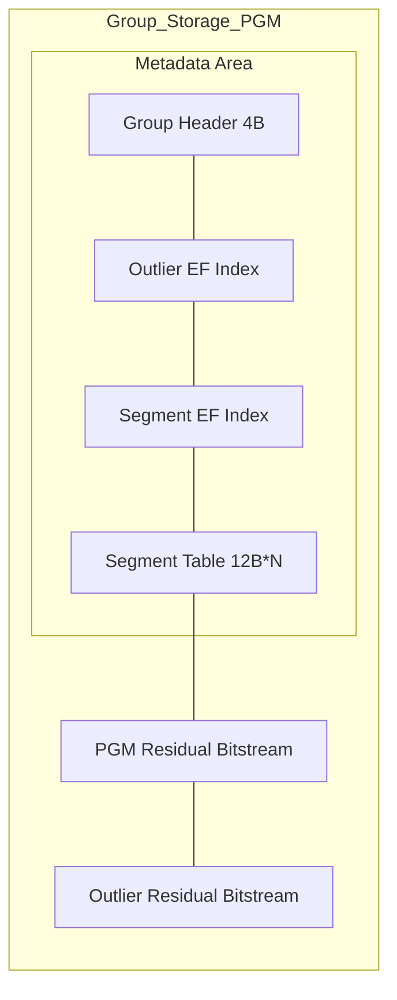

# PGM & Residual Compression: High-Performance Dynamic Address Mapping System

JDB-FTL aims to extremely compress the memory footprint of the address mapping table through advanced compression algorithms and mathematical models without sacrificing access speed.

Our core solution combines **Omnidirectional Slope Fitting**, **Adaptive Residual Encoding**, and **SoA Layout Optimization** to achieve high-performance memory mapping while demonstrating strong robustness in large-scale dynamic update scenarios.

## 1. Core Design Principles

The design goal of JDB-FTL is to ensure 100% mapping accuracy while addressing the following challenges in complex mapping streams:

*   **All-Scenario Precision**: Unlike conventional error approximation models, JDB-FTL ensures that every address restoration achieves bit-level absolute precision through a "Prediction + Residual Compensation" model.
*   **Non-Monotonic Compatibility**: Due to garbage collection or out-of-order writes, mapping sequences often experience regressions. JDB-FTL can identify and fit positive and negative slopes, maintaining long-span linear compression.
*   **Low Maintenance Overhead**: Through a group isolation mechanism, local changes in the mapping table do not trigger a global recalculation "chain reaction," ensuring low latency under high-frequency writes.
*   **Polymorphic Compression**: Automatically switches between PGM fitting, Direct Bit Packing (Direct Mode), or Empty Skipping (Empty Mode) based on data characteristics, ensuring optimal overhead in all scenarios.

## 2. Data Layout & 128KB Limit

JDB-FTL statically divides the global mapping table into multiple independent **Data Groups** to achieve macroscopic $O(1)$ fast positioning.

*   **Logical Granularity & $O(1)$ Positioning**: The number of LBAs managed by each group is determined by the configuration item `GROUP_SIZE` (default 4096). When a read/write request is received, the system directly locks the target group via the instantaneous arithmetic calculation **`LBA / GROUP_SIZE`**. This design completely ends the need for global searches in large-scale mapping tables (hundreds of millions of records), keeping the first-layer positioning overhead constant at $O(1)$.
*   **Physical Composition**: The physical size of a single group is dynamically generated with the following layout:
    - **PGM Mode (Residual-Patch)**: Composed of **4-byte GroupHeader + Outlier EF Index + Segment EF Index + Segment Table (12B×N) + PGM Residual Bitstream + Outlier Residual Bitstream**.
*   **Local Write Barrier**: Due to physical isolation between groups, any update operation (Dirty Range Re-fitting) is confined to an extremely small local memory block, effectively suppressing the impact of "metadata write amplification" on the global system.

### 2.1 Offset Pre-calculation & O(1) Random Access

To support efficient **Single-Point LBA Query**, the segment descriptor explicitly stores a 20-bit **Bit-Offset** field. The encoder pre-fills this field through **cumulative calculation** during serialization, allowing the decoder to read directly, implementing O(1) random access.

```rust
let mut current_offset = (idx_size + meta_size) as u32;

for (f, reuse, start_idx) in &segments {
    let bit_offset_val = if f.bit_width == 0 { 0 } else { current_offset };
    let seg = Seg::new(f.base, f.slope, bit_offset_val, f.bit_width);

    // Accumulate residual size for the next segment.
    if let Some((_, len)) = reuse {
        current_offset += len;
    } else if f.bit_width > 0 {
        current_offset += (f.length * f.bit_width as usize).div_ceil(8) as u32;
    }
}
```

**Decoding Logic (`decode.rs`):**
```rust
fn decode(sub_idx: usize, payload: &[u8]) -> u64 {
    let seg = find_segment(sub_idx);  // O(log N) binary search

    // Key: Directly read the pre-stored offset without traversing
    let byte_offset = seg.bit_offset();
    let delta = read_bits(&payload[byte_offset..], bit_idx, seg.width);

    seg.base + (i * seg.slope >> 24) + delta
}
```

**Design Trade-off**:
- **Space Cost**: +20 bits per segment (approx. 2.5 bytes)
- **Performance Gain**: Single-point query O(1), no need to traverse preceding segments
- **Applicable Scenario**: FTL is dominated by random single-point queries, making O(1) access a core requirement

### 2.2 Group Storage Architecture Diagram

JDB-FTL uses the following data layout:

#### PGM Mode (Residual-Patch, 4-byte Header)



**PGM Mode Data Layout Details:**

- **GroupHeader (4B)**: Contains metadata such as mode flags, segment count, outlier count, outlier bit width, etc.
- **Outlier EF Index**: Uses Elias-Fano encoding to store logical indices of outliers.
- **Seg EF Index**: Uses Elias-Fano encoding to store start indices of segments.
- **Seg Table (12B × N)**: Array of segment descriptors, 12 bytes each.
- **PGM Residual Bitstream**: Residual bitstream for the PGM model.
- **Outlier Residual Bitstream**: Residual bitstream for outliers (using ZigZag encoding).

### 2.3 Polymorphic Compression: Refined Design for Extreme Distributions
To maintain optimal $Byte/Entry$ metrics throughout the lifecycle, the system implements automatic switching of multiple **Group-Level Storage Modes**. Below is the distribution measured under real write Traces:

#### 2.3.1 Empty Group Mode
- **Trigger**: All 4096 LBAs in the group are `u64::MAX` (unmapped or deleted).
- **Fixed Overhead**: **2 bytes** (stores only `Head` marker).
- **Storage**: `storage` array length is 2, extremely low physical footprint.
- **Measured Share**: **~40.3%** (5285/13126), the biggest contributor to system memory friendliness. Logically empty groups are implemented via 0-byte physical storage.

#### 2.3.2 Direct Mode
- **Trigger**: Few valid elements in the group ($n \le 8$).
- **Fixed Overhead**: **2 ~ 10 bytes** (`2B Head` + `0~8B Base`).
- **Storage Layout**:
  ```mermaid
  graph TD
      subgraph Direct_Layout
          direction TB
          H["2B Head"] --> B["Base Value (0~8B)"] --> R["Residuals (N*Width bits)"]
      end
  ```
  - `Head` embeds `count`, `width`, `base_len` metadata (using originally unused 11 bits).
  - `Base` is the minimum `PBA` in the group `min(PBA)`.
  - `Residuals` stores the difference `(PBA - Base)` for each PBA, bit width = `log2(max(PBA) - min(PBA))`.
- **Measured Share**: **~18.8%** (2468/13126).


#### 2.3.3 PGM Mode
- **Trigger**: The group contains a large number of valid elements ($n > 8$).
- **Fixed Overhead**: **4 + OutlierEF + SegEF + N × 12 bytes** (`4B GroupHeader` + `Outlier EF Index` + `Segment EF Index` + `Per Segment 12B Seg`).
- **Storage Layout**: `[4B GroupHeader] | [Outlier EF] | [Seg EF] | [Segments 12B×N] | [PGM Residual Bitstream] | [Outlier Residual Bitstream]`
- **Core Structure**:
  - **GroupHeader (4B)**: Metadata including mode flags, segment count, outlier count, outlier bit width.
  - **Outlier EF**: Logical indices of outliers stored using Elias-Fano, supporting fast determination of whether an LBA is an outlier.
  - **Seg EF**: Start indices of segments stored using Elias-Fano, supporting fast segment positioning.
  - **Segments**: PGM segment descriptor array.
  - **PGM Residual Bitstream**: Residual bitstream for the PGM model.
  - **Outlier Residual Bitstream**: Residual bitstream for outliers (using ZigZag encoding for positive/negative deviations).
- **Advantages**:
  - **Outlier Isolation**: Excludes points destroying the linear trend from the PGM model, avoiding inflation of overall residual bit width.
  - **Higher Compression**: By removing outliers, PGM segments can be longer, reducing metadata overhead.
  - **Safety Guarantee**: Supports Raw Fallback mechanism, automatically reverting to original storage when compression is ideal.

### 2.4 Extreme Encapsulation: 12-Byte Segment Descriptor
Implemented in `src/ftl/seg/mod.rs`. The segment descriptor is the core metadata unit of PGM Mode, locked at **12 bytes (3 Words)** via bit-field packing:
*   **W0 (32b)**: Lower 32 bits of the physical address base.
*   **W1 (32b)**: Upper 16 bits of Base + Lower 16 bits of Bit-Offset.
*   **W2 (32b)**: Upper 4 bits of Bit-Offset + 22-bit Signed Slope + 6-bit Residual Width.

## 3. PGM INDEX + Adaptive Bit-Width Residual Compensation = Lossless Compression

The core idea of JDB-FTL lies in perfectly combining **PGM (Piecewise Geometric Model)** indexing technology with **Adaptive Bit-Width Residual Encoding** to achieve extreme **lossless compression**. This "Mathematical Prediction + Bit Compensation" combination forms a complete loop for the system to achieve nanosecond-level queries and high compression rates.

### 3.1 Core Algorithm Logic: Mathematical Prediction Replacing Path Jumping
PGM is a milestone in modern indexing technology transforming from "passive retrieval" to "active prediction". In JDB-FTL, it plays the role of "macroscopic positioning":
*   **Mathematical Essence**: Accurately fits the Cumulative Distribution Function (CDF) of data through **error-bounded piecewise linear regression**. It treats scattered PBAs as a point set in a coordinate system and fits trends using a series of linear predictors.
*   **Variable-Micro Fitting & Two-Stage Recovery**: The system dynamically slices the address space into variable-length segments. As long as data points are within the deviation range of the predicted line, the segment can extend.
*   **Necessity of Residual Compensation**: Tiny deviations between PGM predicted values and true values are compensated with "bit-level" absolute precision by **Adaptive Bit-Width Residuals**.

### 3.2 Deep Coupling: Bitstream Packing Guided by PGM

Unlike simple prediction, JDB-FTL deeply embeds residual encoding into PGM's fitting cost model. Its core compression flow is as follows:

1.  **Drift Baseline**:
    After fitting the slope, the algorithm scans all points in the segment to calculate the minimum value of `True Value - Predicted Value` as `min_diff`. The segment `Base` is then adjusted to `Base + min_diff`.
    - **Effect**: Ensures all residuals $Delta \ge 0$ within the segment.
    - **Benefit**: Completely eliminates sign bit overhead and compresses numerical space to the absolute minimum.
2.  **Adaptive Bit-Width Determination**:
    The system calculates the number of bits required for the maximum residual in the segment: `Width = 64 - max_residual.leading_zeros()`.
    - **Refined Control**: Each Segment descriptor independently stores its `Width` (6 bits), implementing bit-level on-demand allocation.
3.  **Cost-Driven Segmentation**:
    During greedy expansion, if local noise (outliers) causes the `Width` of the entire segment to surge, the encoder evaluates in real-time: `(Current Total Residual Bit-Width Increment) vs (Cost of Adding a 12B New Descriptor)`.
    - **Decision**: If splitting is more cost-effective, it forces a cut at that point and starts a new segment. This effectively prevents "one bad apple (outlier) spoiling the whole bunch (long segment bit-width)".

    ```mermaid
    graph TD
        S["Detect Residual Bit-Width Surge"] --> C{"Calculate Cost Contrast"}
        C -->|Split| D["Seg A: L=len, W=small"]
        D --> E["Seg B: L=rem, W=large"]
        C -->|Keep| F["Seg Single: L=total, W=large"]

        style D fill:#dfd
        style E fill:#dfd
        style F fill:#f99
    ```

### 3.3 Calculation Formula & Lossless Reconstruction

**Physical Address (PBA) = PGM Prediction (Base + Index × Slope >> 24) + Residual Correction (Delta)**

*   **Slope Precision**: Uses 24-bit Fixed-point, sufficient to maintain extremely high prediction accuracy within a 4096 span.
*   **Residual Extraction**: Extracts `Delta` from the bitstream using efficient bit extraction functions based on pre-stored `Bit-Offset` and `Width`.
*   **Lossless**: Since `Delta` is a complete compensation for prediction error, the restored PBA is 100% consistent with the original value.

### 3.4 Cost-Driven Segmentation: Multi-Level Isolation Mechanism
To protect the long segment span of the main fitting model, JDB-FTL introduces multi-layer noise isolation:
**Core Cost Model**: Monitored in real-time inside the encoder. If severe local fluctuations in physical addresses (non-linear points) cause the bit-width of the entire segment to inflate, the system calculates cost: If `New Metadata (14B)` < `Storage Increment from Old Segment Residual Inflation`, the system proactively cuts the current segment at the optimal position.

### 3.5 Pre-filtering: Isolating Outliers from the Model
Before PGM fitting, JDB-FTL performs strict "Data Densification". This design is key to maintaining high performance in highly fragmented scenarios:

- **Protect Bit-Width**: When training PGM, the system automatically calculates the maximum deviation between predicted and true values to determine residual bit-width. Including `u64::MAX` would force the entire segment width to inflate to 64 bits, causing compression failure.
- **Responsibility Decoupling**:
  - **Elias-Fano Index** handles "existence of data" and "Rank in physical bitstream".
  - **PGM Model** is trained only on continuous valid data sequences.
This "Filter then Fit" strategy ensures that even in extreme fragmentation scenarios where 90% of data is deleted, JDB-FTL's model maintains extremely high linear correlation and compression efficiency.

### 3.6 Model Self-Healing: Greedy Expansion & Smart Merge
JDB-FTL's segmentation is not static but has **Self-healing** dynamic boundaries:
- **Greedy Merge**: During background reconstruction, the encoder always tries to probe the longest fitting path from the current position. If a data update causes points originally belonging to a later segment to now fit the trend of the previous segment, the previous segment automatically merges them through "Forward Annexation" without explicit merge instructions.
- **Cost-Aware**: Merge decisions are economic. If merging two segments causes residual bit-width to surge due to local fluctuations, the system chooses the optimal split point by comparing "14-byte metadata cost" vs "whole segment bit-width inflation cost". This means the system automatically finds the global optimum between "Long Segment + Wide Residual" and "Short Segment + Narrow Residual".

#### Core Algorithm Logic
> Implementation reference: `src/ftl/codec/encoder/pgm.rs`

```python
# Core Logic: Smart Expansion
# When re-encoding a group, even if current segment S is "clean" (unmodified)
# The system still tries to let it "invade" more points backwards

def evaluate_segment(cursor):
    old_seg = get_old_segment(cursor)

    if is_clean(old_seg):
        # 1. Smart Probe
        # Optimization: Only probe when the start (Boundary) of the next segment is modified
        # This guarantees O(1) extreme speed reuse for unmodified areas
        extended_len = old_seg.length

        if next_point_is_dirty(cursor + len):
            while fits_linear_model(data[cursor + extended_len], old_seg):
                extended_len += 1

        # 2. Decision: If it can eat more points, give up reuse and choose merge
        if extended_len > old_seg.length:
            return create_new_segment(base, slope, extended_len)
        else:
            return reuse_old_segment(old_seg)
    else:
        # If old segment is dirty, perform full PGM probe
        return find_longest_segment(data[cursor:])
```

> **Design Implementation: How to achieve Forward/Backward Merge?**
> - **Backward Annexation**: Through the "linear model extrapolation" in the `while` loop above, existing clean segments can seamlessly absorb subsequent updated points, eliminating breaks originally caused by noise.
> - **Forward Absorption**: Since re-fitting starts from `cursor=0`, if the first segment covers a wider area through expansion, the start of subsequent segments naturally moves back, implementing a cascading merge effect throughout the reconstruction flow.

#### 3.6.1 Merge Trigger Mechanism: The Game of Head and Tail
In the dynamic evolution of the segment tree, merges are driven by two main triggers:
- **Backward Annexation**:
  - **Scenario**: Modified the **rear boundary** of Segment A (which is the head of Segment B).
  - **Implementation**: Due to the encoder's **Greedy Probing**, Segment A attempts to extend backwards during reconstruction. If the update at Segment B's head eliminates the original slope jump, Segment A simply crosses the old boundary, swallowing and covering space originally belonging to Segment B.
- **Forward Absorption**:
  - **Scenario**: Modified the **first point** of Segment B (same as above, different perspective).
  - **Implementation**: When the system performs a full rescan in the background, as it processes to where Segment A is about to end, if it finds Segment B's dirty beginning now fits Segment A's error convergence range, Segment A will "elongate" itself. This causes Segment B's start point to move back or even vanish during rearrangement, achieving "Forward Merge".

> **Design Thought: Incremental Reuse vs Full Compression**
> JDB-FTL enables **Smart Incremental Mode** by default in background tasks.
> - **Regular Path**: For untouched segments, directly reuse the old bitstream, achieving $O(1)$ zero-copy flush.
> - **Quality Assurance**: Using the "Smart Expansion" logic described above, the system automatically repairs segment fractures caused by local updates while retaining reuse advantages. Full re-compression is triggered only when segment structure causes excessive metadata ratio due to severe fragmentation (TODO: Fragmentation rate threshold).

## 4. Engineering Optimization: Differential Update & Lossless Reconstruction

### 4.1 Differential Update
In high-frequency small-granular write scenarios, global recalculation of the mapping model is extremely expensive. The incremental logic implemented in `encoder/encode.rs` achieves extreme **Segment-Level $O(1)$ Reuse**:

*   **$O(N+M)$ Monotonic Two-Pointer Scan**:
    - **Preparation**: Update points from `write_buffer` are initially unordered. Before entering the encoder, the background thread first performs `sort_unstable_by_key` on the update sequence (implemented in `bg.rs`), which is the physical prerequisite for efficient scanning.
    - **Linear Comparison**:
        1.  **Initialize**: Set update stream pointer `u_ptr = 0`.
        2.  **Traverse Segments**: For each old segment `[start, end)`:
    - **Status Judgment**: If the current update point LBA falls into `[start, end)`, mark the segment as **Dirty**, requiring re-fit.
            - **Reuse Decision**: If segment is **Clean**, directly reuse its metadata and residual data via `PayloadChunk::Reuse`, requiring zero CPU calculation.
    - **Performance Essence**: This "Sort then Linear Compare" design perfectly fits modern CPU **Pipeline Prefetchers**. Since the data stream is completely monotonic and non-backtracking, judgment overhead is minimized.
*   **Segment Alignment Strategy**:
    - To maximize reuse rate, the new encoder will prioritize attempting to "align" with old version segment boundaries. Even if there is a mathematically better merge solution, as long as the old segment can carry the new data, the algorithm tends to preserve the old structure.
    - **Sync Search**: During fitting, the encoder forward traverses the old index table `old_idxs` to find the last historical boundary point within the current fitting range as a synchronization point. This strategy significantly reduces metadata jitter under minor updates, maintaining high compression stability.

*   **Bitstream Zero-Overhead Reuse (`PayloadChunk::Reuse`)**:
    - For segments undisturbed by updates, JDB-FTL directly reuses the previous version's `Seg` descriptor and uses `PayloadChunk::Reuse` to point directly to the residual bitstream in the old payload.
    - This mechanism implements true "Zero CPU, Zero Memory Copy" incremental application, making background flush overhead proportional to write volume rather than total data volume.

### 4.2 Adaptive Residual Compensation & Bit-Plane Packing
*   **Drift Baseline**: The algorithm automatically fine-tunes base value $b$, ensuring all residuals within the segment are non-negative, transforming the residual stream into a pure unsigned bitstream.
*   **Unaligned Bit-Packing**:
    Using **128-bit Unaligned Peek** technology (optimized for x64/ARM64), a single unaligned memory read retrieves arbitrary bit-width data crossing word boundaries (≤ 56 bits). Combined with bit shift operations, it completely eliminates partial loops and branch judgments. This zero-overhead bit extraction is key to the decoder throughput reaching GiB/s levels.

## 6. Compression Effect Analysis

Based on statistics from real-world Traces (100 million operations, **1.741 million valid LBAs**), JDB-FTL demonstrates excellent compression performance and space efficiency.

### 6.1 Core Compression Data

| Metric                  | Measured Value | Benefit Analysis                                              |
| :---------------------- | :------------- | :------------------------------------------------------------ |
| **Logical Data Total**  | 34.00 MiB      | Logical size of traditional Key-Value mapping (HashMap/BTree) |
| **Physical Storage**    | 6.53 MiB       | Actual usage after PGM + Bit Compression                      |
| **Comprehensive Ratio** | **5.21x**      | Saved approx. **80.8%** memory space                          |

### 6.2 Deep Feature Analysis

- **Data Sparsity Features**:
  In the tested MSRC Trace, although the LBA space reaches 100 million (Max LBA), there are only 1.74 million effective keys, presenting extremely high sparsity. JDB-FTL efficiently handles such sparse distributions through adaptive PGM indexing, requiring only 6.53 MB of memory to index all data, saving **98.4%** space compared to uncompressed linear arrays (410 MB).

- **Bit Width Distribution & Segment Length Features**:
  Thanks to adaptive bit-width residual compensation, JDB-FTL can dynamically adjust the storage bit width of each segment based on local linear characteristics of data. In areas where the PGM model predicts accurately (bit width close to 0), data achieves extremely high compression ratios; while in high-entropy random areas, the system automatically falls back to wider bit widths to ensure precision. This polymorphic compression strategy ensures globally optimal storage efficiency under different data distributions.

- **Void Handling Efficiency**:
  In large-scale sparse address spaces, a large number of data groups are Empty. The system can filter these areas at $O(1)$ cost, so physical memory serves only real existing valid mappings, which is also one of the key reasons why JDB-FTL maintains extremely low memory occupancy on large-capacity SSDs.

### 6.3 Balance of Performance & Space

Tests prove JDB-FTL's PGM implementation is not only theoretically optimal but also highly competitive in engineering practice:
1. **Extreme Payload Compression**: Average less than 1 byte to store an 8-byte PBA.
2. **Extremely Low Metadata Overhead**: Due to high fit, ratio of metadata to Payload remains at ideal levels.
3. **Stable Query Performance**: Combined with $O(1)$ group positioning and bit-offset pre-calculation, extreme compression does not sacrifice random access latency.

### 6.4 Data Validity Analysis

Deep scanning of the Payload residual bitstream from the 100 million operation Trace yields key data on compression quality:

- **Total Residual Items**: ~1.615 million
- **Zero Value Residuals**: 10,378 (Share **0.64%**)
- **Valid Non-Zero Values**: **99.36%**

**Analysis Conclusion**:
This data proves JDB-FTL's extremely high storage efficiency. In the residual bitstream, **over 99.3% of bits carry valid information**. This indicates the PGM model fits extremely tightly, effectively avoiding "waste from zero padding caused by individual outliers inflating bit width," verifying the rationality of the current "Fit + Residual" architecture.

## 7. Conclusion

JDB-FTL achieves extremely high space efficiency in complex real FTL scenarios through engineering improvements to PGM theory, specifically **Omnidirectional Fitting**, **Extreme Compression Layout**, and **Differential Update Mechanism**. This scheme achieves millisecond-level query response no less than pure memory arrays while ensuring 100% data consistency, and demonstrates strong robustness in small update scenarios.
