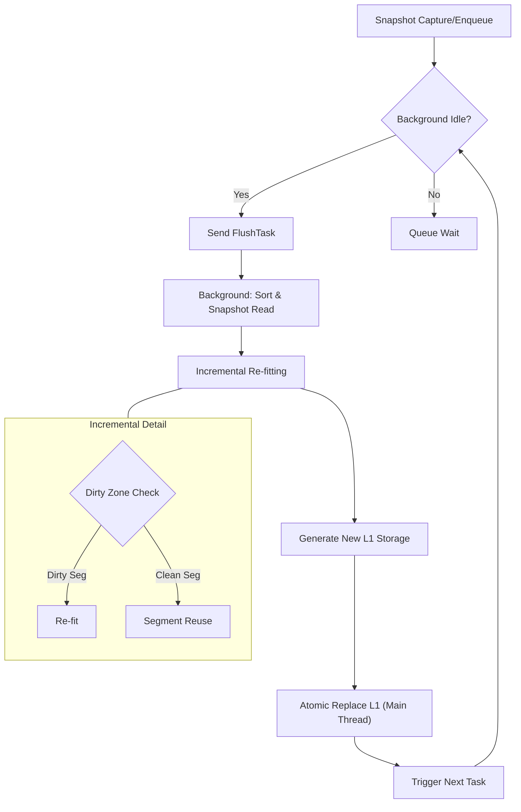
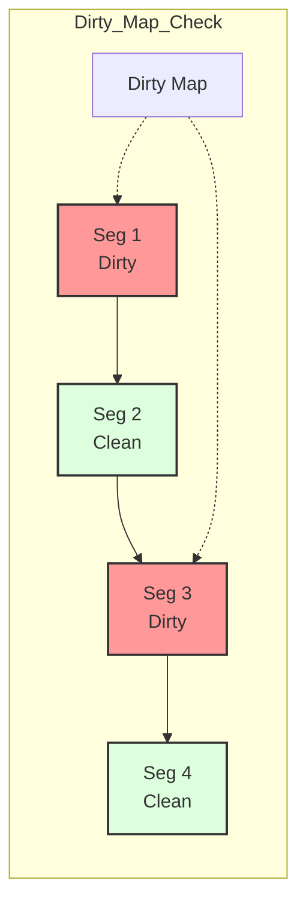
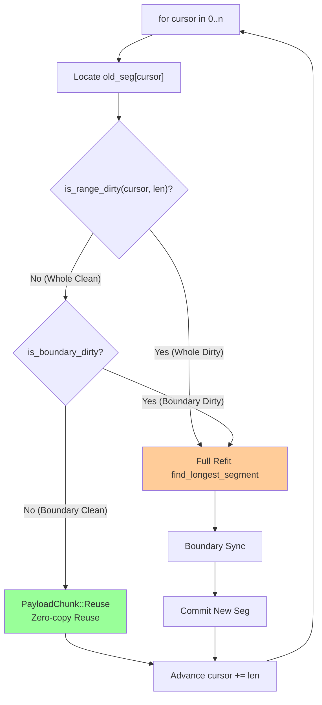

# Background Flush & Incremental Governance: Dynamic Evolution of Mapping Table

JDB-FTL's Background Flush mechanism is responsible for persisting mapping relationships active in the L0 buffer to the highly compressed L1 layer. To prevent the system from "overheating" due to high-frequency small writes, we designed a highly sophisticated incremental processing pipeline.

## 1. Serialized Flush Pipeline

To ensure data consistency and prevent race conditions caused by concurrent updates, the flush process adopts a **"Stop-and-Wait"** mode, ensuring only one active flush task in the background at any given time.

1.  **Snapshot Capture & Enqueue**:
    When the L0 buffer is full, the main thread moves it to the `flushing` queue via `Arc` snapshot.

2.  **Serialized Trigger (Stop-and-Wait)**:
    The system maintains strict serialization constraints: the main thread schedules the task at the head of the queue only when the background thread is idle (i.e., the previous Flush task is fully completed and returned). This ensures the background thread always calculates based on the latest L1 state (State-of-the-World), completely eliminating the risk of data loss from "calculating new values based on old L1 versions".

3.  **Incremental Re-fitting**:
    Upon receiving the task, the background thread sorts Keys in the Buffer by LBA and merges them with the current Group's old data.
    - **Dirty Zone Identification**: Identifies affected segments.
    - **Segment Reuse**: For unaffected clean segments, directly reuses their binary data.

4.  **Atomic Application & Relay**:
    After the background returns processing results, the main thread atomically updates the L1 pointer. The `Done` signal not only marks the end of the current task and memory release but also serves as a "baton" to automatically trigger the next waiting task in the queue.

## 2. Dirty Zone Detection Logic & Boundary Inertia

### 2.1 Dirty Zone Identification
In `bg.rs`, we maintain a `dense_dirty_map` (bitmap) corresponding one-to-one with data points, passed during the encoding phase.
*   **O(1) Query**: Checking if any position or range is "dirty" requires only O(1) index access or slice checking, without binary search in the update list.
*   **Cache Friendly**: `dirty_map` is tightly packed with the data array, maximizing CPU cache line usage.

### 2.2 Boundary Inertia Synchronization
To maximize future reuse rates, the system leverages the **Full Reuse** mechanism to achieve natural "Boundary Inertia":
*   **Strategy Description**: When a segment and its boundaries are unaffected by new data, the system preserves the segment's original form (Base, Slope, Length) without any re-calculation.
*   **Design Motivation**: This ensures that under random write loads, segment reorganization is triggered only by actually modified data regions. This prevents tiny local updates from disrupting global segment stability, maintaining high continuity of the system layout over time.

#### 3.2.1 Smart Expansion Logic

During background re-encoding, the system checks if the **start of the next segment** is modified for each segment to decide whether to start the merge process. The current implementation adopts a robust simplified strategy:

**Core Logic Summary**:
- **Full Reuse Condition**: Current Segment Clean **AND** Next Segment Start Clean → `Reuse` (Zero-copy)
- **Other Cases**: Trigger `FullRefit` (Re-fit), ensuring optimal linear model generation.

## 3. Benefits of Incremental Encoding

By introducing the `PayloadChunk::Reuse` mechanism, JDB-FTL's background flush overhead is proportional to **actual write variations**, not total global data.

1.  **CPU Offloading**:
    *   **90%+ Segment Reuse**: Under typical Zipfian write loads, the vast majority of segments are "cold". The system moves data directly via `memcpy` (PayloadChunk::Reuse), skipping expensive `find_longest_segment` linear regression calculations.
2.  **Efficient Outlier Migration**:
    *   **O(N) Two-Pointer Algorithm**: For reused segments, their attached Outliers are migrated to the new list via a linear Two-Pointers scan, avoiding nested loop searches and reducing complexity from O(M*N) to O(M+N).
3.  **Memory Bandwidth Optimization**:
    *   **BitWriter Reuse**: The underlying bit writer supports Reset reuse, avoiding memory allocation and reclamation for a large number of small objects.

## 4. Conclusion

JDB-FTL's background mechanism proves that an efficient system should not just passively receive data but should possess the ability to "perceive change" and "respond precisely". This incremental governance internally reduces system power consumption and provides guarantees for stable operation in ultra-high throughput environments.
