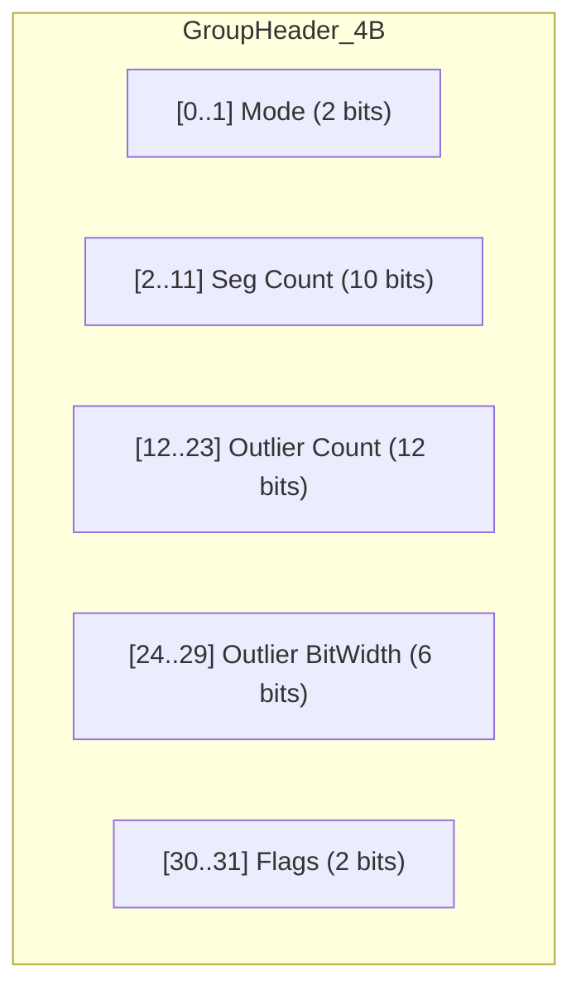
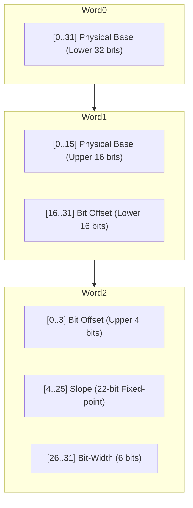

# Extreme Performance Implementation and Optimization Insights

The outstanding performance of JDB-FTL is no accident; it is the result of deeply exploiting hardware characteristics, memory layout, and instruction pipelines. This chapter takes a deep dive into the key optimizations that have reduced lookup latency to the nanosecond level.

## 1. Hardware-Friendly Memory Layout

### 1.1 Ultra-Compact Header (4-Byte Head)
The `Head` is the entry point for every Group. We use **4 bytes** (32 bits) to store metadata, supporting larger segment counts and outlier management:

 **Bit Layout Reference:**

 
 This design allows instant pipeline switching based solely on the header, without needing extra flag bits.

### 1.2 Compact Segment Descriptor (12-Byte Seg)
The core metadata unit for PGM mode, bit-packed into 12 bytes:

**Seg Descriptor (Bit Layout) Reference:**

### 1.3 Memory Alignment
As mentioned in the `Data Layout` chapter, we limit segment descriptors to 12 bytes.
*   **Physical Alignment Hack**: The group header is fixed at 2 bytes (`Head`). By defining all metadata fields with `u16` and using `repr(C)` layout, we ensure that segment descriptors (`Seg`) follow the start index table (`u16` array) immediately and always reside on **2-byte aligned** boundaries, eliminating any internal or external padding holes.
*   **Spatial Efficiency & CPU Friendliness**: While 2-byte alignment may seem "weaker" than 4/8-byte alignment, it perfectly fits the extremely compact nature of FTL metadata. Modern CPUs incur minimal overhead for such low-alignment accesses, while every 1.6 bytes saved (on average) translates into significant memory gains across large-scale mapping tables.

### 1.4 SoA Layout and CPU Cache
*   **Columnar Storage Advantage**: We store all segment `start_idx` (LBA offsets) together in a continuous array.
*   **Binary Search Acceleration**: When querying segments within a group, the CPU only needs to search within the start-index table. Because this `u16` data is highly compact, the entire binary search process is extremely likely to stay entirely within the **L1 Data Cache**. Compared to traditional Array of Structures (AoS), the Structure of Arrays (SoA) layout increases the "Useful Data Ratio" during lookups several-fold.

## 2. High-Performance Query Primitives

### 2.1 128-bit Unaligned Peek (Variable-Length Bit Reading)
Residual bitstreams are variable-length, and traditional reading methods involve significant bit-shifting (`>>`), masking (`&`), and branch logic.
*   **Optimization Logic**: We implemented an auto-detecting unaligned pre-reading technique based on `u64` (for bit-widths ≤ 56 bits) or `u128`. The system loads a sufficiently wide data stream from memory (`std::ptr::read_unaligned`) in a single pass and extracts residuals instantly using shifts and masks.
*   **Avoiding Branch Mispredictions**: The core logic contains no complex `if/else` branching to handle residuals spanning across byte boundaries. Since the bit-width (Width) is constant within a segment, the compiler can generate extremely efficient branchless instruction sequences.

### 2.2 Avoiding Multiplication: Iterative Accumulators
The linear prediction formula for PGM is typically $PBA = Base + (index \times Slope \gg 24)$.
*   **Pain Point**: Multiplication instructions have much higher latency than shifting and addition and occupy more execution units.
*   **Solution**: In scenarios such as Range Scans, JDB-FTL leverages piecewise linearity to convert multiplication into **forward accumulation**. By maintaining an accumulator register, subsequent addresses simply add a `Slope` to the previous address, perfectly fitting the instruction pipeline of superscalar machines.

## 3. Extremely Compact Metadata (12B Compact Seg)

Typical PGM segments might occupy 24 to 32 bytes. JDB-FTL compresses a single segment into **12 bytes** through rigorous bit-field splitting:

| Bit-Offset  | Field Name        | Description                                                     |
| :---------- | :---------------- | :-------------------------------------------------------------- |
| **0 - 47**  | **Physical Base** | 48-bit physical base address (supports PB-level storage)        |
| **48 - 67** | **Bit Offset**    | 20-bit bit offset (supports 128KB compressed payload)           |
| **68 - 89** | **Slope**         | 22-bit omnidirectional fixed-point slope (supports +/- fitting) |
| **90 - 95** | **Bit-Width**     | 6-bit bit-width descriptor (supports 0-63bit residuals)         |

This compactness increases metadata density more than two-fold, allowing the same amount of CPU cache to buffer more segment information.

## 4. Conclusion

JDB-FTL is more than just an algorithm library; it is a precision instrument designed for modern hardware architectures, with **PGM INDEX + Adaptive Residual Compensation = Lossless Compression** as its soul. Through micrometer-level control over cache, pipelines, and bit-storage, we prove that in software engineering, reasonable layout design can achieve multi-fold performance premiums without sacrificing functionality.
