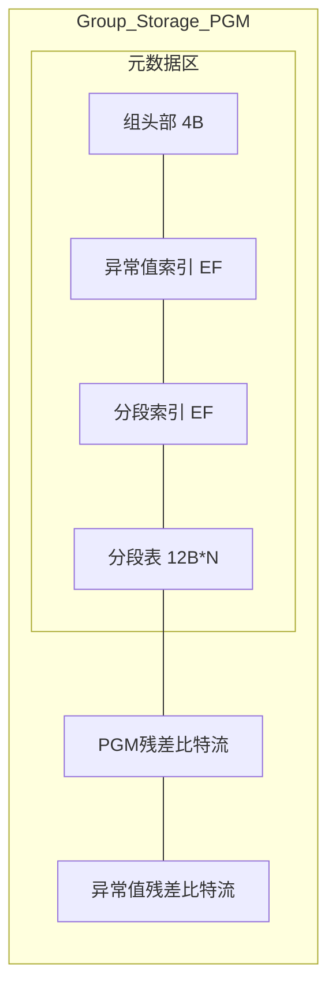
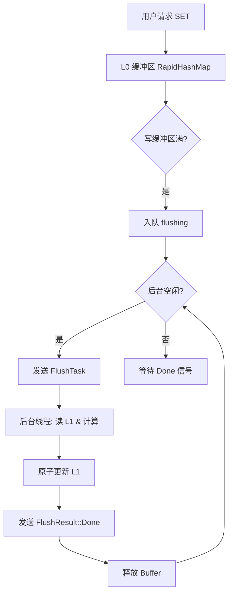

# 系统架构与并发设计：高性能映射表的基石

JDB-FTL 采用读写分离的双层存储架构，其技术核心为 **PGM INDEX + 自适应位宽残差补偿 = 无损压缩**。结合基于 Rust 内存安全特性的无锁并发设计，在保障极致压缩率的同时，实现了毫秒级的写入响应与纳秒级的查询延迟。

## 1. 双层混合存储模型

为了平衡非对称的读写特性，JDB-FTL 将映射表划分为职责明确的两层：

### 1.1 L0 层：写入缓冲区
*   **物理实现**：基于 `RapidHashMap`（高性能哈希表）的内存存储，刷新时排序。
*   **职责**：负责接收实时写入请求。它能够以 $O(1)$ 的复杂度处理随机 LBA 更新，避免了高频写入直接触动复杂的 PGM 压缩结构。
*   **特性**：读写性能极高，但不具备压缩能力。

### 1.2 L1 层：多态压缩映射层
*   **多态存储**：每个 Group 根据数据密度自动选择最优存储格式：
    1.  **空模式**: 零存储开销（物理存储 0 字节）。
    2.  **直接模式**: 针对稀疏/小数据量（<=8 items），直接存储值和残差，无 PGM 开销。
    3.  **PGM 模式（残差补丁）**: 针对稠密数据及存在离群点的场景，采用结构体数组布局的 PGM 分段线性回归压缩，通过离群点隔离实现更高的压缩率。

#### 组存储架构图

**PGM 模式（4字节头部）**

*   **物理实现**：由多个紧凑排列的 `Group` 组成，通过 4 字节 `GroupHeader` 动态自省。
*   **职责**：存储绝大部分历史地址映射。通过变长拟合与比特流打包，将内存占用压低至极致。
*   **特性**：极致压缩，针对高频读取优化，但重构成本较高（需后台线程异步完成）。

## 2. 高性能并发架构：单序写与无锁并发读

JDB-FTL 充分利用 Rust 的所有权与内存布局特性，实现了真正意义上的“读写不冲突”。

### 2.1 无锁读取路径
*   **核心原语**：通过 `SharedL1`（内部封装 `Arc<InternalSyncCell<L1>>`）实现对 L1 层的引用。
*   **性能黑科技**：读取请求（`GET`）可以通过 `get_ref()` 直接获取内存引用，完全绕过了多层解引用，实现了"直通硬件"的访问速度。
*   **安全性保证**：利用 `Arc` 的强引用计数确保读取期间内存不会被回收。

### 2.2 严格串行化写入一致性
*   **写时复制机制**：所有的修改操作（`SET`）通过 `Arc::make_mut` 实现写时复制（Copy-On-Write），确保同一时间只有一个写入序列在进行。
*   **停止等待刷新协议**：为了彻底根除 L1 更新的竟态条件，系统采用严格的串行化刷新策略。
    1.  **入队**：当 L0 满时，将其移入 `flushing` 队列。
    2.  **序列化触发**：仅当后台线程空闲（队列为空或前一个任务完成）时，才触发下一个 Flush 任务。
    3.  **接力机制**：`FlushResult::Done` 信号不仅标志着内存释放，更作为“接力棒”触发队列中下一个 Buffer 的处理。这确保了后台线程总是基于最新的 L1 状态进行计算 ，从而保证数据绝对一致性。

## 3. 数据生命周期全链路

数据从写入 L0 到最终持久化至 L1 的全过程，是一个严密的流水线作业。这一过程通过 **停止等待** 协议严格串行化，确保了极端并发下的数据一致性。

> 详细的后台刷新机制与增量算法，请参考独立文档：[后台刷新与增量治理](./flush.md)

## 4. 结论

通过 L0/L1 分层架构与无锁读设计，JDB-FTL 在复杂生产环境下展现出了极强的韧性：它以 **PGM INDEX + 自适应位宽残差补偿 = 无损压缩** 为核心，在提供极致压缩率的同时，通过 L0 吸收瞬时的高并发写入，最终达成高性能存储系统性能与空间的完美平衡。
