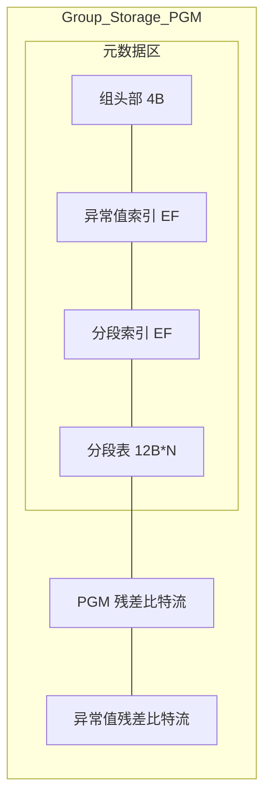

# PGM 与残差压缩：高性能动态地址映射系统

JDB-FTL 旨在通过先进的压缩算法与数学模型，在不牺牲访问速度的前提下，极致压缩地址映射表的内存占用。

我们的核心方案结合了 **全向斜率拟合**、**自适应残差编码** 以及 **SoA 布局优化**，实现了极高性能的内存映射，同时在大规模动态更新场景下表现出极强的稳健性。


## 1. 核心设计原则

JDB-FTL 的设计目标是在保证 100% 映射精确度的前提下，解决复杂映射流中的以下挑战：

*   **全场景精确度**：不同于常规的误差近似模型，JDB-FTL 通过“预测 + 残差补偿”模型，确保每一个地址还原都达到比特级的绝对精确。
*   **非单调性兼容**：由于垃圾回收或乱序写入，映射序列经常出现回落。JDB-FTL 能够识别并拟合正负斜率，维持长跨度的线性压缩。
*   **低维护开销**：通过分组隔离机制，映射表的局部变动不会引发全局重算的“连锁反应”，保证了在高频写入下的低延迟。
*   **多态压缩**：根据数据特征自动切换 PGM 拟合、直接位打包（Direct Mode）或空值跳过（Empty Mode），确保全场景下的最优开销。


## 2. 数据布局与 128KB 限制

JDB-FTL 将全局映射表静态划分为多个独立的 **数据组**，以实现宏观上的 $O(1)$ 快速定位。

*   **逻辑粒度与 $O(1)$ 定位**：每个组管理的逻辑块地址数量由配置项 `GROUP_SIZE`（默认 4096）决定。当收到读写请求时，系统直接通过 **` 逻辑块地址 / GROUP_SIZE`** 这一瞬时的算术计算锁定目标组。这种设计彻底终结了在大规模映射表（数亿条记录）中进行全局搜索的必要，使首层定位开销恒定为 $O(1)$。
*   **组内物理构成**：单个组的物理大小动态生成，具有以下布局：
    - **PGM 模式 (Residual-Patch)**：由 **4 字节组头部 (GroupHeader) + 异常值 EF 索引 + 分段 EF 索引 + 分段表 (12B×N) + PGM 残差比特流 + 异常值残差比特流** 组成。
*   **局部写屏障**：由于组间物理隔离，任何更新操作（Dirty Range 重拟合）都被限制在极其微小的局部内存块内，有效抑制了“元数据写放大”对全局系统的冲击。

### 2.1 偏移预计算与 O(1) 随机访问

为支持高效的**单点逻辑块地址查询**，分段描述符中显式存储了 20 位的**位偏移**字段。编码器在序列化时通过**累积计算**预填充该字段，解码器可直接读取，实现 O(1) 随机访问。

```rust
    let mut current_offset = (idx_size + meta_size) as u32;

    for (f, reuse, start_idx) in &segments {
        let bit_offset_val = if f.bit_width == 0 { 0 } else { current_offset };
        let seg = Seg::new(f.base, f.slope, bit_offset_val, f.bit_width);

        // 累加本段残差大小，为下一段做准备
        if let Some((_, len)) = reuse {
            current_offset += len;
        } else if f.bit_width > 0 {
            current_offset += (f.length * f.bit_width as usize).div_ceil(8) as u32;
        }
    }
```

**解码逻辑 (`decode.rs`)：**
```rust
fn decode(sub_idx: usize, payload: &[u8]) -> u64 {
    let seg = find_segment(sub_idx);  // O(log N) 二分查找

    // 关键：直接读取预存储的偏移，无需遍历
    let byte_offset = seg.bit_offset();
    let delta = read_bits(&payload[byte_offset..], bit_idx, seg.width);

    seg.base + (i * seg.slope >> 24) + delta
}
```

**设计权衡**：
- **空间代价**：每段 +20 bits（约 2.5 字节）
- **性能收益**：单点查询 O(1)，无需遍历前序段
- **适用场景**：FTL 以随机单点查询为主，O(1) 访问是核心需求

### 2.2 组存储架构图


JDB-FTL 使用以下数据布局：

#### PGM 模式（Residual-Patch，4 字节头部）




**PGM 模式数据布局详解：**

- **GroupHeader (4B)**: 包含模式标志、分段数量、异常值数量、异常值位宽等元数据

- **Outlier EF Index**: 使用 Elias-Fano 编码存储异常值的逻辑索引

- **Seg EF Index**: 使用 Elias-Fano 编码存储分段的起始索引

- **Seg Table (12B × N)**: 分段描述符数组，每个 12 字节

- **PGM Residual Bitstream**: PGM 模型的残差比特流

- **Outlier Residual Bitstream**: 异常值的残差比特流（使用 ZigZag 编码）

### 2.3 多态压缩：针对极端分布的精细化设计
为了在全生命周期内维持最优 $Byte/Entry$ 指标，系统实现了多种**组级存储模式 (Group-Level Storage Modes)** 的自动切换。以下是在真实写入 Trace 下的分布实测：


#### 2.3.1 空组模式
- **触发条件**：整个组 4096 个逻辑块地址均为 `u64::MAX`（未映射或已删除）。
- **固定开销**：**2 字节** (仅存储 `Head` 标记)。
- **存储**：`storage` 数组长度为 2，物理占用极低。
- **实测占比**：**~40.3%** (5285/13126)，是系统内存友好性的最大贡献者。空组逻辑上通过 0 字节 physical storage 实现。

#### 2.3.2 直接模式
- **触发条件**：组内有效元素极少（$n \le 8$ 个）。
- **固定开销**：**2 ~ 10 字节** (`2B Head` + `0~8B Base`)。
- **存储布局**：

  ```mermaid
  graph TD
      subgraph Direct_Layout
          direction TB
          H["2B Head"] --> B["Base Value (0~8B)"] --> R["Residuals (N*Width bits)"]
      end
  ```

  - `Head` 中嵌入 `count`, `width`, `base_len` 元数据（利用原本闲置的 11 bits）。
  - `Base` 是组内所有 PBA 的最小值 `min(PBA)`。
  - `Residuals` 存储每个 PBA 与 Base 的差值 `(PBA - Base)`，位宽 = `log2(max(PBA) - min(PBA))`。
- **实测占比**：**~18.8%** (2468/13126)。


#### 2.3.3 PGM 模式
- **触发条件**：组内有效元素数量较多 ($n > 8$ 个)。
- **固定开销**：**4 + OutlierEF + SegEF + N × 12 字节** (`4B GroupHeader` + `异常值 EF 索引` + `分段 EF 索引` + `每分段 12B Seg`)。
- **存储布局**：`[4B GroupHeader] | [Outlier EF] | [Seg EF] | [Segments 12B×N] | [PGM Residual Bitstream] | [Outlier Residual Bitstream]`
- **核心结构**：
  - **GroupHeader (4B)**: 包含模式标志、分段数量、异常值数量、异常值位宽等元数据
  - **Outlier EF**: 使用 Elias-Fano 编码存储异常值的逻辑索引，支持快速判断某个逻辑块地址是否为异常值
  - **Seg EF**: 使用 Elias-Fano 编码存储分段的起始索引，支持快速定位分段
  - **Segments**: PGM 分段描述符数组
  - **PGM Residual Bitstream**: PGM 模型的残差比特流
  - **Outlier Residual Bitstream**: 异常值的残差比特流，使用 ZigZag 编码处理正负偏差
- **优势**：
  - **离群点隔离**：将破坏线性趋势的点从 PGM 模型中剔除，避免拉高整体残差位宽
  - **更高压缩率**：通过离群点剔除，PGM 分段可以更长，元数据开销更低
  - **安全性保障**：支持 Raw Fallback 机制，当压缩率不理想时自动回退到原始存储

### 2.4 极致封装：12 字节分段描述符
实现在 `src/ftl/seg/mod.rs`。分段描述符是 PGM 模式的核心元数据单元，通过位域打包锁定在 **12 字节 (3 Words)**：
*   **W0 (32b)**：存储物理地址基准的低 32 位。
*   **W1 (32b)**：存储 Base 的高 16 位 + 位偏移的低 16 位。
*   **W2 (32b)**：存储 Bit-Offset 的高 4 位 + 22 位符号斜率 + 6 位残差位宽。


## 3. PGM INDEX + 自适应位宽残差补偿 = 无损压缩

JDB-FTL 的核心思想在于将 **PGM (Piecewise Geometric Model)** 索引技术与**自适应位宽残差编码**完美结合，达成极致的**无损压缩**。这种“数学预测 + 比特补偿”的组合方案，构成了系统实现纳秒级查询与高压缩率的完整闭环。

### 3.1 核心算法逻辑：以数学预测替代路径跳转
PGM 是现代索引技术从“被动检索”向“主动预测”转型的里程碑。在 JDB-FTL 中，它扮演着“宏观定位”的角色：
*   **数学本质**：通过**误差受限的分段线性回归**，精准拟合数据的累积分布函数 (CDF)。它将散乱的 PBA 视为坐标系中的点集，并利用一系列线性预测器对其进行趋势拟合。
*   **变微拟合与两级恢复**：系统动态将地址空间切分为变长段。只要数据点在预测直线的偏斜范围内，分段即可延伸。
*   **残差补偿的必要性**：PGM 预测值与真实值之间的微小偏差由**自适应位宽残差**进行“比特级”绝对精确补偿。

### 3.2 深度耦合：PGM 引导下的比特流打包

不同于简单的预测，JDB-FTL 将残差编码深度嵌入 PGM 的拟合代价模型中。其核心压缩流程如下：

1.  **漂移基准线 (Drift Baseline)**：
    在拟合出斜率后，算法会扫描段内所有点，计算 `真实值 - 预测值` 的最小值 `min_diff`。随后将段基准值 `Base` 调整为 `Base + min_diff`。
    - **效果**：确保段内所有残差 $Delta \ge 0$。
    - **收益**：彻底消除了符号位开销，且将数值空间压到了绝对最小。
2.  **自适应位宽确定**：
    系统计算段内最大残差所需的比特数：`Width = 64 - max_residual.leading_zeros()`。
    - **精细化控制**：每个 Segment 描述符独立存储其 `Width`（6 bits），实现了比特级的按需分配。
3.  **代价驱动分段**：
    在贪心扩张时，若由于局部噪音（离群点）导致全段 `Width` 剧增，编码器会实时评估：`(当前总残差位宽增量) vs (新增一个 12B 定点描述符的开销)`。
    - **决策**：若切分更划算，则强制在该点切断并开启新段。这有效防止了“一颗老鼠屎（离群点）坏了一锅粥（长分段位宽）”。

    ```mermaid
    graph TD
        S["检测到残差位宽剧增"] --> C{"计算开销对比"}
        C -->|Split| D["Seg A: L=len, W=small"]
        D --> E["Seg B: L=rem, W=large"]
        C -->|Keep| F["Seg Single: L=total, W=large"]

        style D fill:#dfd
        style E fill:#dfd
        style F fill:#f99
    ```

### 3.3 计算公式与无损重建

**物理地址 (PBA) = PGM 预测 (基准 + 索引 × 斜率 ≫ 24) + 残差修正 (偏差)**

*   **斜率精度**：采用 24 位定点数（Fixed-point），足以在 4096 跨度内维持极高的预测精度。
*   **残差提取**：根据预存的 `Bit-Offset` 和 `Width`，利用高效的位提取函数从比特流中取出 `Delta`。
*   **无损性**：由于 `Delta` 是对预测误差的完整补偿，还原出的 PBA 与原始值 100% 一致。

### 3.4 代价驱动分段：多级隔离机制
为了保护主拟合模型的长分段跨度，JDB-FTL 引入了多层噪音隔离：
**核心代价模型**：在编码器内部实时监测。若由于物理地址的局部剧烈波动（非线性点）导致全段位宽膨胀，系统会核算成本：如果 `新增元数据 (14B)` < `旧段残差膨胀带来的存储增量 `，系统会在最优位置主动切断当前段。

### 3.5 预过滤：将离群点隔离在模型之外
JDB-FTL 在进行 PGM 拟合前，会执行严格的“数据稠密化”操作，这一设计是系统在高碎片化场景下维持高性能的关键：

- **保护位宽**：训练 PGM 时，系统会自动计算预测值与真实值的最大偏差以确定残差位宽。包含 `u64::MAX` 会迫使全段位宽膨胀至 64 位，导致压缩失效。
- **职责解耦**：
  - **Elias-Fano 索引** 负责解决“有没有数据”以及“该数据在物理位流中的秩 (Rank)”。
  - **PGM 模型** 仅针对连续的有效数据序列进行训练。
这种“先过滤再拟合”的策略，确保了即使在 90% 数据被删除的极端碎片化场景下，JDB-FTL 的模型依然能保持极高的线性相关度和压缩效率。

### 3.6 模型自愈：贪婪扩张与智能合并
JDB-FTL 的分段不是静态的，而是具备 **自愈性 (自愈)** 的动态边界：
- **贪婪合并**：在后台重构时，编码器始终尝试从当前位置探测最长拟合路径。如果由于某次数据更新，使得原本属于后一个线段的点现在符合前一个线段的趋势，前一个线段会通过“前向吞并”自动将其合并，无需显式的合并指令。
- **代价平衡 (代价感知)**：合并决策是基于经济性的。如果合并两个段会导致残差位宽（Bit-width）由于局部波动而剧增，系统会通过对比“14 字节元数据成本”与“全段位宽膨胀成本”，选择存储效率最高的最优分段点。这意味着系统能自动在“长线段+宽残差”与“短线段+窄残差”之间找到全局最优解。

#### 核心算法逻辑
> 实现参考：`src/ftl/codec/encoder/pgm.rs`

```python
# 核心逻辑：智能扩张
# 当重新编码一个组时，即使当前线段 S 是“干净”的（未被修改）
# 系统依然会尝试让其向后“侵略”更多点

def evaluate_segment(cursor):
    old_seg = get_old_segment(cursor)

    if is_clean(old_seg):
        # 1. 尝试拉伸 (Smart Probe)
        # 优化：仅当下一个线段的起点（Boundary）被修改时，才启动探测
        # 这保证了未修改区域的 O(1) 极速复用
        extended_len = old_seg.length

        if next_point_is_dirty(cursor + len):
            while fits_linear_model(data[cursor + extended_len], old_seg):
                extended_len += 1

        # 2. 决策：如果能吃掉更多点，就放弃复用，选择合并
        if extended_len > old_seg.length:
            return create_new_segment(base, slope, extended_len)
        else:
            return reuse_old_segment(old_seg)
    else:
        # 如果旧段脏了，执行全量 PGM 探测
        return find_longest_segment(data[cursor:])
```

> **设计落地：如何实现向前/向后合并？**
> - **向后吞并**：通过上述 `while` 循环中的“线性模型外推”，原有的干净线段可以无缝吸纳其后的更新点，从而消除原本因噪声导致的断裂。
> - **向前吸收**：由于重拟合是从 `cursor=0` 开始的，如果第一个分段通过扩张覆盖了更广泛的区域，后续的分段起点会自然向后推移，从而在整个重构流中实现级联式的合并效果。

#### 3.6.1 合并触发机制：头部与尾部的博弈
在线段树的动态演进中，合并主要由两个触发点驱动：
- **向后吞并**：
  - **情景**：修改了线段 A 的**后方边界**（即线段 B 的头部）。
  - **实现**：由于编码器的 **贪婪探测** 特性，线段 A 在重新重构时会尝试向后延伸。如果线段 B 头部的更新消除了原本的斜率跳变，线段 A 将直接越过旧边界，吞噬并覆盖原本属于线段 B 的空间。
- **向前吸纳**：
  - **情景**：修改了线段 B 的**第一个点**（同上，视角不同）。
  - **实现**：系统在后台执行全量重扫描时，当处理到原本线段 A 即将结束时，如果发现后续的线段 B 的脏开头现在符合 A 的误差收敛范围。此时，线段 A 会“拉长”自己，从而在重排过程中导致线段 B 的起点后移甚至消失，实现“向前合并”。

> **设计思考：增量复用 vs 全量压缩**
> JDB-FTL 在后台任务中默认开启**智能增量模式**。
> - **常规路径**：对于未触及的线段，直接复用旧的比特流，实现 $O(1)$ 的零拷贝刷新。
> - **质量保障**：利用上文所述的“智能扩张”逻辑，系统能在保留复用优势的同时，自动修复因局部更新导致的线段断裂。只有当线段结构因严重碎片化导致元数据占比过高时，才会触发全量重压缩（TODO: 碎片率阈值）。

## 4. 工程化优化：差量更新与无损重建

### 4.1 差量更新
在高频小颗粒写入场景下，全局重算映射模型极其昂贵。实现在 `encoder/encode.rs` 中的增量逻辑实现了极致的**分段级 $O(1)$ 复用**：

*   **$O(N+M)$ 单调双指针扫描**：
    - **前置准备**：来自 `write_buffer` 的更新点最初是无序的。在进入编码器前，后台线程会首先对更新序列执行 `sort_unstable_by_key` 操作（实现在 `bg.rs`），这是实现高效扫描的物理前提。
    - **线性比对**：
        1.  **初始化**：设置更新流指针 `u_ptr = 0`。
        2.  **遍历分段**：对于每个旧分段 `[start, end)`：
    - **判定状态**：若当前更新点逻辑块地址落入 `[start, end)`，则标记该段为 **脏**，需重拟合。
            - **复用决策**：若段为**净**，则直接能够通过 `载荷块复用` 复用其元数据与残差数据，无需任何 CPU 计算。
    - **性能精髓**：这种“先排序、后线性比对”的设计完美契合现代 CPU 的 **流水线预取器**。由于数据流完全单调且不回溯，判定开销被降至最低。
*   **分段对齐策略**：
    - 为了最大化复用率，新编码器会优先尝试与旧版本的分段边界“对齐”。即使数学上有更优的合并方案，只要旧分段能承载新数据，算法也会倾向于保留旧结构。
    - **同步搜寻**：在拟合过程中，编码器会前向遍历旧索引表 `old_idxs`，寻找当前拟合范围内的最后一个历史边界点作为同步点。这种策略显著降低了微小更新下的元数据抖动，保持了极高的压缩稳定性。

*   **比特流零开销复用 (` 载荷块复用`)**：
    - 对于未受更新干扰的分段，JDB-FTL 会直接复用前一版本的 `Seg` 描述符，并利用 `载荷块复用` 直接指向旧有效负载中的残差位流。
    - 这种机制实现了真正意义上的“零 CPU、零内存拷贝”增量应用，使后台刷新开销与写入量而非总数据量成正比。

### 4.2 自适应残差补偿与位平面打包
*   **漂移基准线**：算法会自动微调基准值 $b$，确保段内所有残差均为非负数，从而将残差流转化为纯粹的无符号位流。
*   **Unaligned Bit-Packing**：
    利用 **128-bit 非对齐预读取** 技术（针对 x64/ARM64 优化），单次非对齐内存读取即可获取跨越字边界的任意位宽数据（≤ 56 bits），结合位移运算，彻底消除了循环读取和分支判断。这种零开销的比特提取是解码器吞吐量能达到 GiB/s 级别的关键。


## 6. 压缩效果分析

基于实战 Trace（1 亿次操作，**174.1 万有效逻辑块地址**）的统计结果，JDB-FTL 展现了卓越的压缩性能与空间效率。

### 6.1 核心压缩数据

| 指标             | 实测数值  | 收益分析                                |
| :--------------- | :-------- | :-------------------------------------- |
| **逻辑数据总量** | 34.00 MiB | 传统键值映射 (HashMap/BTree) 的逻辑规模 |
| **物理存储占用** | 6.53 MiB  | 经过 PGM + 位压缩后的实际占用           |
| **综合压缩倍率** | **5.21x** | 节省了约 **80.8%** 的内存空间           |

### 6.2 深度特征分析

- **数据稀疏性特征**：
  在本次测试的 MSRC Trace 中，虽然逻辑块地址空间达到了 1 亿 (Max 逻辑块地址)，但实际有效键仅 174 万，呈现极高的稀疏性。JDB-FTL 通过自适应 PGM 索引，能够高效处理此类稀疏分布，仅占用 6.53 MB 内存即可索引所有数据，相比无压缩的线性数组 (410 MB) 节省了 **98.4%** 的空间。

- **位宽分布与段长度特征**：
  由于采用了自适应位宽残差补偿，JDB-FTL 能够根据数据的局部线性特征动态调整每个段的存储位宽。在 PGM 模型预测准确的区域（位宽接近 0），数据能够获得极高的压缩比；而在高熵随机区域，系统自动回退到更宽的位宽以保证精确性。这种多态压缩策略确保了在不同的数据分布下都能获得全局最优的存储效率。

- **空洞处理效率**：
  在大规模稀疏地址空间中，大量数据组为空（Empty）。系统能够以 $O(1)$ 的代价直接过滤掉这些区域，使物理内存仅需服务于真实存在的有效映射，这也是 JDB-FTL 能在大容量 SSD 上保持极低内存占用的关键原因之一。

### 6.3 性能与空间的平衡

实测证明，JDB-FTL 的 PGM 实现不仅在理论上最优，在工程实践中也极具竞争力：
1. **Payload 极致压缩**：平均不到 1 字节即可存储一个 8 字节的 PBA。
2. **元数据开销极低**：由于高拟合度，元数据与 Payload 的比例保持在理想水平。
3. **查询性能稳定**：配合 $O(1)$ 的分组定位与位偏移预计算，极致压缩并未牺牲随机访问的延迟。

### 6.4 数据有效性分析

通过对 1 亿次操作 Trace 的 Payload 残差比特流进行深度扫描，我们得到了关于压缩质量的关键数据：

- **总残差项**: ~161.5 万个
- **零值残差**: 10, 378 个 (占比 **0.64%**)
- **有效非零值**: **99.36%**

**分析结论**：
该数据证明了 JDB-FTL 极高的存储效率。在残差位流中，**超过 99.3% 的比特位都在承载有效信息**。这说明 PGM 模型拟合得极度紧凑，有效规避了“因个别离群点拉高位宽而产生的零填充浪费”，验证了当前“拟合+残差”架构的合理性。


## 7. 结论

JDB-FTL 通过对 PGM 理论的工程化改良，特别是**全向拟合**、**极致压缩布局**与**差量更新机制**，在复杂的 FTL 真实场景中达成了极高的空间效率。本方案在确保 100% 数据一致性的前提下，实现了不亚于纯内存数组的毫秒级查询响应，且在微小更新场景下表现出极强的鲁棒性。