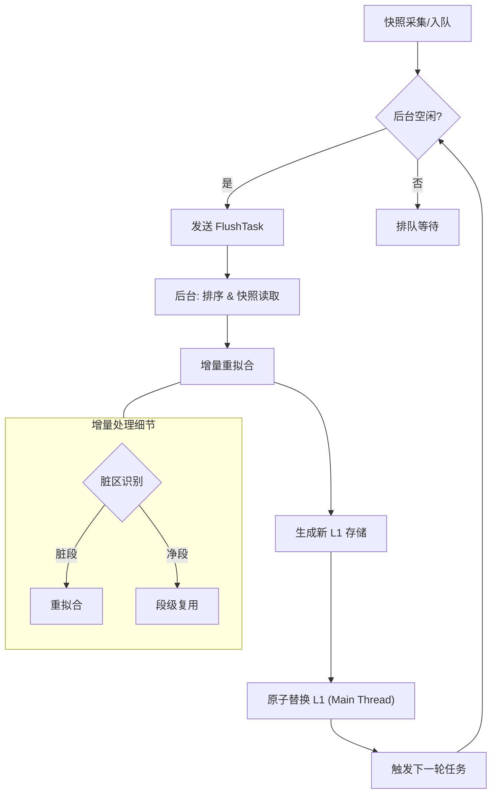
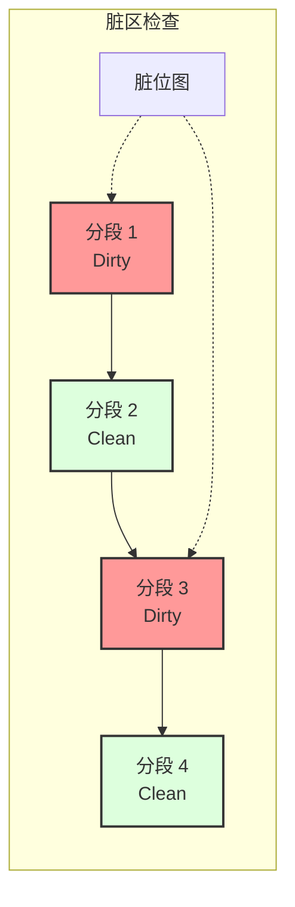
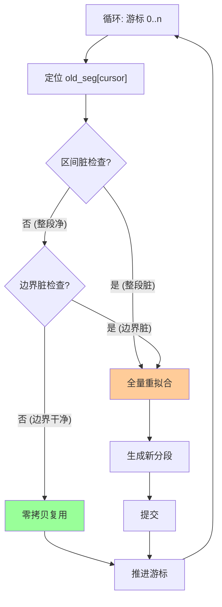

# 后台刷新与增量治理：映射表的动态进化

JDB-FTL 的后台刷新机制（Flush）负责将活跃在 L0 缓冲区的映射关系持久化到高度压缩的 L1 层。为了防止高频小写导致系统“过热”，我们设计了一套高度精密的增量处理流水线。

## 1. 串行化刷新流水线

为了保证数据的一致性，防止并发更新导致的竟态条件，刷新过程采用 **"Stop-and-Wait"** 模式，确保任意时刻在后台只有一个活跃的刷新任务。

1.  **快照采集与入队**：
    当 L0 缓冲区写满时，主线程将其通过 `Arc` 快照方式移入 `flushing` 队列。

2.  **序列化触发**：
    系统维护严格的串行化约束：仅当后台线程空闲（即前一个 Flush 任务已完全完成并返回）时，主线程才会调度队列头部的任务。这确保了后台线程总是基于最新的 L1 状态进行计算 (State-of-the-World)，彻底根除了“基于旧版本 L1 计算新值”的数据丢失风险。

3.  **增量重拟合**：
    后台线程接收任务后，对 Buffer 内的 Key 按 LBA 排序，并与当前 Group 的旧数据进行归并处理。
    - **脏区识别**：识别受影响的分段。
    - **段级复用**：对于未受影响的干净分段，直接复用其二进制数据。

4.  **原子化应用与接力**：
    后台返回处理结果后，主线程原子更新 L1 指针。`Done` 信号不仅标志着当前任务结束和内存释放，更作为“接力棒”自动触发队列中下一个等待的任务。

## 2. 脏区探测逻辑与边界惯性

### 2.1 脏区识别
在 `bg.rs` 中，我们维护了一个与数据点一一对应的 `dense_dirty_map` (bitmap)，并在编码阶段传入。
*   **O(1) 查询**：判断任意位置或区间是否“脏”，只需 O(1) 的索引访问或切片检查，无需在更新列表中进行二分查找。
*   **缓存友好**：`dirty_map` 与数据数组紧密排列，极大地利用了 CPU 缓存行。

### 2.2 边界惯性同步
为了最大化未来的复用率，系统利用 **全量复用 (Full Reuse)** 机制实现了天然的“边界惯性”：
*   **策略描述**：当分段及其边界未受新数据影响时，系统会直接保留该分段的原始形态（Base、Slope、Length），不进行任何重新计算。
*   **设计动机**：这种策略确保了在随机写负载下，只有被实际修改的数据区域才会触发分段重组，防止微小的局部更新破坏全局的分段稳定性，使系统布局在时间轴上保持高度的连续性。

#### 3.2.1 智能扩张逻辑

在后台重编码时，系统会为每个分段检测**下一个线段的起点** 是否被修改，以决定是否启动合并流程。目前的实现采用稳健的简化策略：

**核心逻辑总结**：
- **完全复用条件**：当前段 Clean **且** 下一段起点也 Clean → `Reuse` (零拷贝)
- **其他情况**：触发 `FullRefit` (重新拟合)，确保生成最优线性模型。

## 3. 增量编码的收益

通过引入 `PayloadChunk::Reuse` 机制，JDB-FTL 的后台刷新开销与**实际写入的变动量**成正比，而非与全局数据总量成正比。

1.  **CPU 卸载**：
    *   **90%+ 的分段复用**：在典型的 Zipfian 写入负载下，绝大多数分段是“冷”的。系统直接通过 `memcpy` (PayloadChunk::Reuse) 搬运数据，跳过了昂贵的 `find_longest_segment` 线性回归计算。
2.  **异常点高效迁移**：
    *   **O(N) 双指针算法**：对于复用的分段，其附属的 Outliers 会通过一次线性的双指针扫描（Two-Pointers）直接迁移到新列表中，避免了嵌套循环查找，将复杂度从 O(M*N) 降低到 O(M+N)。
3.  **内存带宽优化**：
    *   **BitWriter 复用**：底层位写入器支持 Reset 复用，避免了大量小对象的内存分配与回收。

## 4. 结论

JDB-FTL 的后台机制证明了：一个高效的系统不应该只是被动地接收数据，而应该具备“感知变动”并“精准响应”的能力。这种增量治理由内而外地减少了系统功耗，并为在超高吞吐环境下的稳定运行提供了保障。
