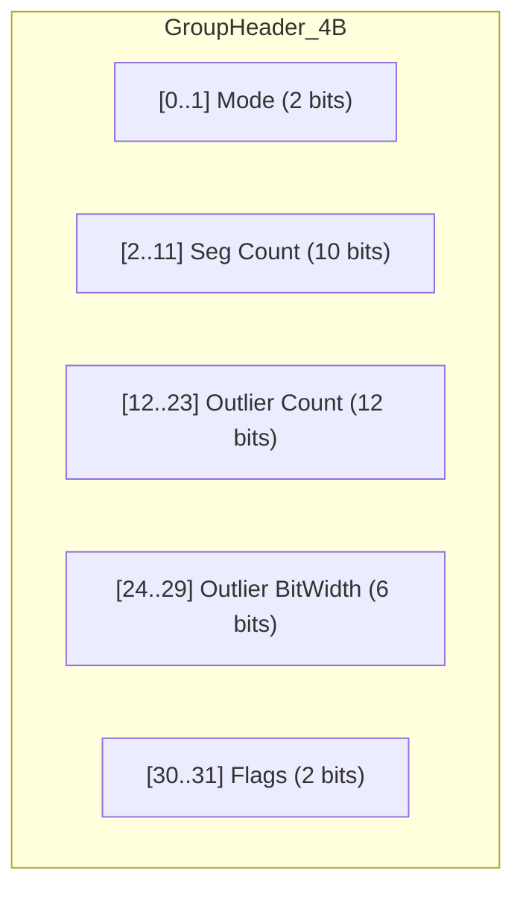
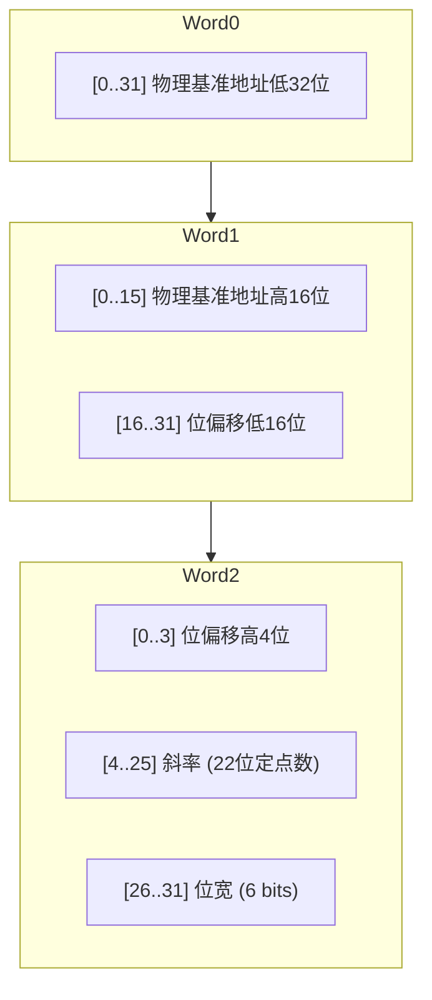

# 极致性能实现与优化内幕

JDB-FTL 的卓越性能并非偶然，而是对硬件特性、内存布局和指令流水线深度压榨的结果。本章将深入剖析那些让查询延迟降低到纳秒级的关键优化。

## 1. 硬件友好的内存布局

### 1.1 极致压缩的头部
`Head` 是每个 Group 的入口，我们使用 **4 字节**（32 bits）来存储元数据，以支持更大的分段数量和异常值管理：

**位布局 (位布局)对照：**

这种设计使得无需额外标记位，仅凭头部即可瞬间切换解析管线。

### 1.2 紧凑分段描述符
PGM 模式的核心元数据单元，通过位域打包锁定在 12 字节：

**Seg Descriptor (位布局)对照：**

### 1.3 SoA 布局与 CPU 缓存
*   **列式存储优势**：我们将所有分段的 `start_idx`（LBA 偏移）集中存储在一个连续的数组中。
*   **二分查找加速**：在组内查询分段时，CPU 只需在起始索引表中进行。由于这些 `u16` 数据高度紧凑，整个二分查找的过程极大概率完全命中 **L1 Data Cache**。相比于传统的记录级存储（数组结构体），SoA 布局在查找时的有效数据率（有效数据率）提升了数倍。

## 2. 高性能查询原语

### 2.1 变长比特读取
残差位流是变长的，传统的读取方式涉及大量的位移 (`>>`)、掩码 (`&`) 和分支判断。
*   **优化逻辑**：我们实现了基于 `u64`（针对 56 位以下位宽）或 `u128` 的自动探测式非对齐预读取技术。系统单次从内存载入足够宽的数据流（`std::ptr::read_unaligned`），通过位移和掩码即可瞬间提取残差。
*   **规避分支预测错误**：核心逻辑不包含复杂的 `if/else` 处理残差跨字节的情况。由于位宽（Width）在当前分段内是常量，编译器能生成极度精简的无分支指令序列。

### 2.2 乘法规避：迭代累加器
PGM 的线性预测公式通常为 $PBA = Base + (index \times Slope \gg 24)$。
*   **痛点**：乘法指令的延迟远高于位移和加法，且会占用更多的执行单元。
*   **方案**：在范围扫描 (范围扫描) 等场景下，JDB-FTL 利用分段线性特性，将乘法转换为**前项累加**。通过维护一个累加寄存器，后续地址只需在上一个地址基础上增加一份 `Slope`，完美契合超标量机器的指令流水线。

## 3. 极致精简的元数据

常规的 PGM 段可能占用 24 到 32 字节。JDB-FTL 通过苛刻的位域拆分，将单个分段压缩至 **12 字节**：

| 位偏移      | 字段名称          | 描述                                 |
| :---------- | :---------------- | :----------------------------------- |
| **0 - 47**  | **Physical Base** | 48 位物理基准地址（支持 PB 级存储）  |
| **48 - 67** | **Bit Offset**    | 20 位比特偏移（支持 128KB 压缩负载） |
| **68 - 89** | **Slope**         | 22 位全向定点斜率（支持正负拟合）    |
| **90 - 95** | **Bit-Width**     | 6 位位宽描述（支持 0-63bit 残差）    |

这种紧凑性直接将元数据密度提升了 2 倍以上，相同容量的 CPU Cache 能够缓存更多的分段信息。

## 4. 结论

JDB-FTL 不仅仅是一个算法库，更是一个以 **PGM INDEX + 自适应位宽残差补偿 = 无损压缩** 为灵魂、面向现代硬件架构设计的精密仪器。通过对缓存、流水线、位存储的微米级控制，我们证明了：在软件工程中，通过合理的布局设计，可以在不牺牲功能性的前提下，实现数倍的性能溢价。
