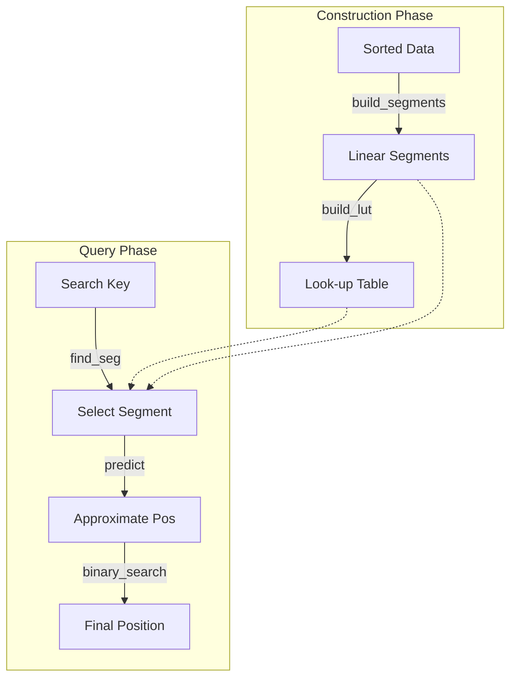

# jdb_pgm : Ultra-fast Learned Index for Sorted Keys

> A highly optimized, single-threaded Rust implementation of the Pgm-index (Piecewise Geometric Model index), designed for ultra-low latency lookups and minimal memory overhead.


- [Introduction](#introduction)
- [Usage](#usage)
- [Performance](#performance)
- [Features](#features)
- [Design](#design)
- [Technology Stack](#technology-stack)
- [Directory Structure](#directory-structure)
- [API Reference](#api-reference)
- [History](#history)

---

## Introduction

`jdb_pgm` is a specialized reimplementation of the Pgm-index data structure. It approximates the distribution of sorted keys using piecewise linear models, enabling search operations with **O(log ε)** complexity.

This crate focuses on **single-threaded performance**, preparing for a "one thread per CPU" architecture. By removing concurrency overhead and optimizing memory layout (e.g., SIMD-friendly loops), it achieves statistically significant speedups over standard binary search and traditional tree-based indexes.

## Usage

Add this to your `Cargo.toml`:

```toml
[dependencies]
jdb_pgm = "0.3"
```

### Two Modes

**`Pgm<K>`** - Core index without data ownership (ideal for SSTable, mmap scenarios)

```rust
use jdb_pgm::Pgm;

fn main() {
  let sorted: Vec<u64> = (0..1_000_000).collect();

  // Build index from sorted data reference
  let pgm = Pgm::new(&sorted, 32);

  // Get predicted search range
  let range = pgm.predict_range(123_456);

  // Search in your own data store
  // Note: Range is not Copy. We use range.start/end to create a slice index.
  if let Ok(pos) = sorted[range.start..range.end].binary_search(&123_456) {
    println!("Found at index: {}", range.start + pos);
  }
}
```

**`PgmData<K>`** - Index with data ownership (convenient for in-memory use)

```rust
use jdb_pgm::PgmData;

fn main() {
  let sorted: Vec<u64> = (0..1_000_000).collect();

  // Build index and take ownership of data
  let index = PgmData::new(&sorted, 32);

  // Direct lookup
  if let Some(pos) = index.get(123_456) {
    println!("Found at index: {}", pos);
  }
}
```

### Feature Flags

- `data` (default): Enables `PgmData` struct with data ownership
- `bitcode`: Enables serialization via bitcode
- `key_to_u64`: Enables `key_to_u64()` helper for byte keys

## Performance

Based on internal benchmarks with 1,000,000 `u64` keys (jdb_pgm's Pgm does not own data, memory is index-only):

*   **~2.3x Faster** than standard Binary Search (17.85ns vs 40.89ns).
*   **~1.1x - 1.3x Faster** than [pgm_index](https://crates.io/crates/pgm_index) (17.85ns vs 20.13ns).
*   **~4.7x Faster** than BTreeMap (17.85ns vs 84.21ns).
*   **~2.2x Faster** than HashMap (17.85ns vs 39.99ns).
*   **1.01 MB Index Memory** for `ε=32` (pgm_index uses 8.35 MB).
*   Prediction Accuracy: jdb_pgm max error equals ε exactly, pgm_index max error is 8ε.

## 🆚 Comparison with `pgm_index`

This crate (`jdb_pgm`) is a specialized fork/rewrite of the original concept found in [`pgm_index`](https://crates.io/crates/pgm_index). While the original library aims for general-purpose usage with multi-threading support (Rayon), `jdb_pgm` takes a different approach:

### Key Differences Summary

| Feature | jdb_pgm | pgm_index |
|---------|---------------|-----------|
| Threading | Single-threaded | Multi-threaded (Rayon) |
| Segment Building | Shrinking Cone O(N) | Parallel Least Squares |
| Prediction Model | `slope * key + intercept` | `(key - intercept) / slope` |
| Prediction Accuracy | ε-bounded (guaranteed) | Heuristic (not guaranteed) |
| Memory | Arc-free, zero-copy | Arc<Vec<K>> wrapper |
| Data Ownership | Always retain data or no ownership | Always owns data |
| Dependencies | Minimal | rayon, num_cpus, num-traits |

### Architectural Shift: Single-Threaded by Design

The original `pgm_index` introduces Rayon for parallel processing. However, in modern high-performance databases (like ScyllaDB or specialized engines), the **thread-per-core** architecture is often superior.

*   **One Thread, One CPU**: Removed all locking, synchronization, and thread-pool overhead.
*   **Deterministic Latency**: Without thread scheduling jitter, p99 latencies are significantly more stable.

### Segment Building Algorithm

**jdb_pgm: Shrinking Cone (Optimal PLA)**

The streaming algorithm guarantees that prediction error never exceeds ε, while least squares fitting provides no such guarantee.

```rust
// O(N) streaming algorithm with guaranteed ε-bound
while end < n {
  slope_lo = (idx - first_idx - ε) / dx
  slope_hi = (idx - first_idx + ε) / dx
  if min_slope > max_slope: break  // cone collapsed
  // Update shrinking cone bounds
}
slope = (min_slope + max_slope) / 2
```

**pgm_index: Parallel Least Squares**

```rust
// Divides data into fixed chunks, fits each with least squares
target_segments = optimal_segment_count_adaptive(data, epsilon)
segments = (0..target_segments).par_iter().map(|i| {
  fit_segment(&data[start..end], start)  // least squares fit
}).collect()
```

### Prediction Formula

**jdb_pgm**: `pos = slope * key + intercept`
- Direct forward prediction
- Uses FMA (Fused Multiply-Add) for precision

**pgm_index**: `pos = (key - intercept) / slope`
- Inverse formula (solving for x given y)
- Division is slower than multiplication
- Risk of division by zero when slope ≈ 0

### Core Implementation Upgrades

While based on the same Pgm theory, implementation details are significantly more aggressive:

*   **Eliminating Float Overhead**: Replaced expensive floating-point rounding operations (`round/floor`) with bitwise-based integer casting (`as isize + 0.5`).
*   **Transparent to Compiler**: Core loops refactored to remove dependencies that block LLVM's auto-vectorization, generating AVX2/AVX-512 instructions.
*   **Reducing Branch Misprediction**: Rewrote `predict` and `search` phases with manual clamping and branchless logic, drastically reducing pipeline stalls.

### Allocation Strategy

*   **Heuristic Pre-allocation**: Build process estimates segment count `(N / 2ε)` ahead of time, effectively eliminating vector reallocations during construction.
*   **Zero-Copy Processing**: Handles sorted keys (especially integers) while avoiding unnecessary copies.

## Features

*   **Single-Threaded Optimization**: Tuned for maximum throughput on a dedicated core.
*   **Zero-Copy Key Support**: Supports `u8`, `u16`, `u32`, `u64`, `i8`, `i16`, `i32`, `i64`.
*   **Predictable Error Bounds**: The `epsilon` parameter strictly controls the search range.
*   **Simplified API**: Removed complex sorting strategies, focusing on pre-sorted data.
*   **Flexible Data Ownership**: `Pgm` for external data, `PgmData` for owned data.

## Design

The index construction and lookup process allows for extremely fast predictions of key positions.



### Construction Phase

The dataset is scanned to create Piecewise Linear Models (segments) that approximate the key distribution within an error `ε`. Each segment stores:
- `min_key`, `max_key`: Key range boundaries
- `slope`, `intercept`: Linear model parameters
- `start_idx`, `end_idx`: Data position range

A secondary lookup table (LUT) enables O(1) segment selection by mapping key ranges to segment indices.

### Query Phase

1. **Segment Selection**: Use the lookup table to find the appropriate segment for the query key.
2. **Position Prediction**: Apply the linear model `pos = slope * key + intercept` to get an approximate position.
3. **Refined Search**: Perform binary search within the bounded range `[pos - ε, pos + ε]` for exact match.

This design ensures that the binary search operates on a tiny window (typically < 64 elements) regardless of dataset size, achieving near-constant lookup time.

## Technology Stack

*   **Core**: Rust (Edition 2024)
*   **Algorithm**: Pgm-Index (Piecewise Geometric Model)
*   **Testing**: `aok`, `static_init`, `criterion` (for benchmarks)
*   **Memory**: tikv-jemalloc for precise memory measurement

## Directory Structure

```text
jdb_pgm/
├── src/
│   ├── lib.rs          # Exports and entry point
│   ├── pgm.rs          # Core Pgm struct (no data ownership)
│   ├── data.rs         # PgmData struct (with data ownership)
│   ├── build.rs        # Segment building algorithm
│   ├── types.rs        # Key trait, Segment, PgmStats
│   ├── consts.rs       # Constants
├── tests/
│   ├── pgm.rs          # Integration tests for Pgm
│   ├── pgm_range.rs    # Range prediction tests
│   └── data.rs         # Integration tests for PgmData
├── benches/
│   ├── main.rs         # Criterion benchmark suite
│   └── bench_*.rs      # Individual benchmark files
├── examples/
│   ├── simple_benchmark.rs
│   └── test_pgm_bitcode.rs
└── readme/
    ├── en.md
    └── zh.md
```

## API Reference

### Core Types

#### `Pgm<K>` (Core, no data ownership)

The primary index structure that holds only the index metadata, not the data itself. Ideal for scenarios where data is stored externally (SSTable, memory-mapped files).

**Construction**

```rust
pub fn new(sorted: &[K], epsilon: usize) -> Self
```

Builds the index from a sorted data slice.

- `sorted`: Reference to sorted key array
- `epsilon`: Maximum prediction error (controls segment granularity)
- Returns: `Pgm<K>`

**Prediction Methods**

```rust
pub fn predict(key: K) -> usize
```

Returns the predicted position for a key using the linear model.

```rust
pub fn predict_range(key: K) -> std::ops::Range<usize>
```

Returns the search range `start..end` for a key, bounded by epsilon.

**Search Methods**

```rust
pub fn find<'a, Q, F>(&self, key: &Q, get_key: F) -> usize
where
    Q: ToKey<K> + ?Sized,
    F: Fn(usize) -> Option<&'a [u8]>,
```

Finds the insertion point for a key using byte comparison. Returns the index where the key would be inserted.

```rust
pub fn find_key<F>(&self, key: K, get_key: F) -> usize
where
    F: Fn(usize) -> Option<K>,
```

Finds the insertion point using Key type comparison.

**Metadata Methods**

```rust
pub fn segment_count() -> usize
```

Returns the number of segments in the index.

```rust
pub fn avg_segment_size() -> f64
```

Returns the average number of keys per segment.

```rust
pub fn mem_usage() -> usize
```

Returns memory usage of the index (excluding data).

```rust
pub fn len() -> usize
pub fn is_empty() -> bool
```

Standard collection methods.

#### `PgmData<K>` (With data ownership, requires `data` feature)

Convenient wrapper that owns both the index and the data, providing direct lookup methods.

**Construction**

```rust
pub fn new(sorted: &[K], epsilon: usize) -> Self
```

Builds the index from a sorted data slice and takes ownership (copies data).

**Lookup Methods**

```rust
pub fn get(key: K) -> Option<usize>
```

Returns the index of the key if found, or `None`.

```rust
pub fn get_many<'a, I>(&'a self, keys: I) -> impl Iterator<Item = Option<usize>> + 'a
where
    I: IntoIterator<Item = K> + 'a,
```

Batch lookup returning an iterator of results.

```rust
pub fn count_hits<I>(&self, keys: I) -> usize
where
    I: IntoIterator<Item = K>,
```

Counts how many keys from the iterator exist in the index.

**Metadata Methods**

```rust
pub fn sorted() -> &[K]
```

Returns reference to underlying sorted data.

```rust
pub fn memory_usage() -> usize
```

Returns total memory usage (data + index).

```rust
pub fn stats() -> PgmStats
```

Returns comprehensive statistics including segment count, average segment size, and memory usage.

#### `Segment<K>`

Represents a single linear segment in the index.

```rust
pub struct Segment<K: Key> {
    pub min_key: K,      // Minimum key in this segment
    pub max_key: K,      // Maximum key in this segment
    pub slope: f64,      // Linear model slope
    pub intercept: f64,  // Linear model intercept
    pub start_idx: u32,  // Starting data index
    pub end_idx: u32,    // Ending data index (exclusive)
}
```

#### `PgmStats`

Index statistics structure.

```rust
pub struct PgmStats {
    pub segments: usize,           // Number of segments
    pub avg_segment_size: f64,     // Average keys per segment
    pub memory_bytes: usize,       // Total memory usage
}
```

#### `Key` Trait

Trait defining requirements for indexable key types.

```rust
pub trait Key: Copy + Send + Sync + Ord + Debug + 'static {
    fn as_f64(self) -> f64;
}
```

Implemented for: `u8`, `i8`, `u16`, `i16`, `u32`, `i32`, `u64`, `i64`, `u128`, `i128`, `usize`, `isize`.

#### `ToKey<K>` Trait

Trait for types that can be converted to Key and provide byte reference.

```rust
pub trait ToKey<K: Key> {
    fn to_key(&self) -> K;
    fn as_bytes(&self) -> &[u8];
}
```

Implemented for: `[u8]`, `&[u8]`, `Vec<u8>`, `Box<[u8]>`, `[u8; N]`.

### Helper Functions

```rust
pub fn key_to_u64(key: &[u8]) -> u64  // Requires `key_to_u64` feature
```

Converts key bytes to u64 prefix (big-endian, pad with 0).

```rust
pub fn build_segments<K: Key>(sorted: &[K], epsilon: usize) -> Vec<Segment<K>>
```

Low-level function to build segments using the shrinking cone algorithm.

```rust
pub fn build_lut<K: Key>(sorted: &[K], segments: &[Segment<K>]) -> (Vec<u32>, f64, f64)
```

Low-level function to build the lookup table.

## History

In the era of "Big Data," traditional B-Trees became a bottleneck due to their memory consumption and cache inefficiency. Each node in a B-Tree stores multiple keys and pointers, leading to poor cache locality and high memory overhead.

突破性进展出现在 2020 年，Paolo Ferragina 和 Giorgio Vinciguerra 在论文"The PGM-index: a fully-dynamic compressed learned index with provable worst-case bounds"中提出了 **分段几何模型 (Pgm) 索引**。他们的核心见解简单而具有革命性：如果数据分布通常遵循可预测的模式，为什么还要存储每个键呢？

通过将索引视为机器学习问题——学习数据的累积分布函数（CDF）——他们在保持 O(log N) 最坏情况性能的同时，将索引大小减少了几个数量级。Pgm-index 使用分段线性函数近似键分布，其中每个 segment 保证预测误差永远不会超过指定的 epsilon。

本项目 `jdb_pgm` 借鉴了这一概念，并将其剥离至最本质的 Rust 实现。通过专注于单线程性能和消除开销，它在每一纳秒都至关重要的现代 CPU 上优先考虑原始速度——这正是高性能数据库在线程绑定核心架构时代所需要的。