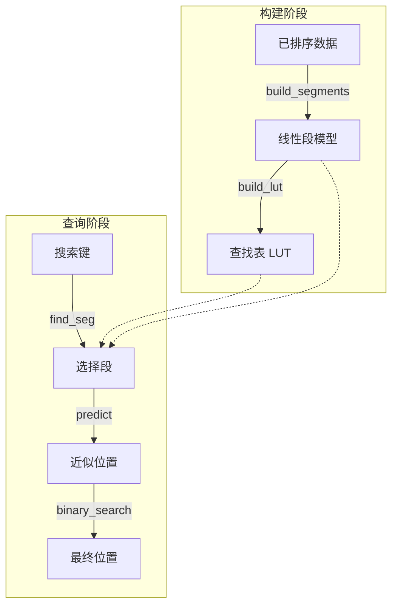

# jdb_pgm : 面向排序键的超快学习型索引

> 经过高度优化的 Rust 版 Pgm 索引（分段几何模型索引）单线程实现，专为超低延迟查找和极小内存开销而设计。


- [简介](#简介)
- [使用方法](#使用方法)
- [性能](#性能)
- [特性](#特性)
- [设计](#设计)
- [技术栈](#技术栈)
- [目录结构](#目录结构)
- [API 参考](#api-参考)
- [历史背景](#历史背景)

---

## 简介

`jdb_pgm` 是 Pgm-index 数据结构的专用重构版本。它使用分段线性模型近似排序键的分布，从而实现 **O(log ε)** 复杂度的搜索操作。

本 crate 专注于 **单线程性能**，为"一线程一核 (One Thread Per CPU)"的架构做准备。通过移除并发开销并优化内存布局（如 SIMD 友好的循环），与标准二分查找和传统树状索引相比，它实现了具有统计意义的显著速度提升。

## 使用方法

在 `Cargo.toml` 中添加依赖：

```toml
[dependencies]
jdb_pgm = "0.3"
```

### 两种模式

**`Pgm<K>`** - 核心索引，不持有数据（适用于 SSTable、mmap 场景）

```rust
use jdb_pgm::Pgm;

fn main() {
  let sorted: Vec<u64> = (0..1_000_000).collect();

  // 从已排序数据引用构建索引
  let pgm = Pgm::new(&sorted, 32);

  // 获取预测的搜索范围
  let range = pgm.predict_range(123_456);

  // 在自己的数据存储中搜索
  // 注意：Range 不实现 Copy，如果后续需要 range.start，需先保存或重新构建 Range
  // 这里演示仅使用 range 的用法：
  if let Ok(pos) = sorted[range.start..range.end].binary_search(&123_456) {
    println!("Found at index: {}", range.start + pos);
  }
}
```

**`PgmData<K>`** - 持有数据的索引（适用于内存使用场景）

```rust
use jdb_pgm::PgmData;

fn main() {
  let sorted: Vec<u64> = (0..1_000_000).collect();

  // 构建索引并获取数据所有权
  let index = PgmData::new(&sorted, 32);

  // 直接查找
  if let Some(pos) = index.get(123_456) {
    println!("Found at index: {}", pos);
  }
}
```

### Feature 标志

- `data`（默认）：启用持有数据的 `PgmData` 结构体
- `bitcode`：启用 bitcode 序列化
- `key_to_u64`：启用 `key_to_u64()` 辅助函数用于字节键

## 性能

基于 1,000,000 个 `u64` 键的内部基准测试（jdb_pgm 的 Pgm 不持有数据，仅统计索引内存）：

*   比标准二分查找 **快 ~2.3 倍**（17.85ns vs 40.89ns）。
*   比 [pgm_index](https://crates.io/crates/pgm_index) **快 ~1.1 - 1.3 倍**（17.85ns vs 20.13ns）。
*   比 BTreeMap **快 ~4.7 倍**（17.85ns vs 84.21ns）。
*   比 HashMap **快 ~2.2 倍**（17.85ns vs 39.99ns）。
*   在 `ε=32` 时，索引内存仅 **1.01 MB**（pgm_index 为 8.35 MB）。
*   预测精度：jdb_pgm 最大误差严格等于 ε，pgm_index 最大误差为 8ε。

## 🆚 与 `pgm_index` 的对比

本 crate (`jdb_pgm`) 是原版 [`pgm_index`](https://crates.io/crates/pgm_index) 概念的专用分叉/重写版本。原版库旨在通用并支持多线程（Rayon），而 `jdb_pgm` 采取了截然不同的优化路径：

### 核心差异总结

| 特性 | jdb_pgm | pgm_index |
|------|---------------|-----------|
| 线程模型 | 单线程 | 多线程 (Rayon) |
| 段构建算法 | 收缩锥 O(N) | 并行最小二乘法 |
| 预测公式 | `slope * key + intercept` | `(key - intercept) / slope` |
| 预测精度 | ε 有界（保证） | 启发式（无保证） |
| 内存 | 无 Arc，零拷贝 | Arc<Vec<K>> 包装 |
| 数据所有权 | 始终保留数据或不持有 | 始终持有数据 |
| 依赖 | 最小化 | rayon, num_cpus, num-traits |

### 架构转型：原生单线程设计

原版 `pgm_index` 引入了 Rayon 进行并行处理。然而，在现代高性能数据库（如 ScyllaDB 或专用引擎）中，**线程绑定核心 (Thread-per-Core)** 架构往往更具优势。

*   **一线程一 CPU**：移除了所有的锁、同步原语和线程池开销。
*   **确定的延迟**：没有了线程调度的抖动，p99 延迟显著更加稳定。

### 段构建算法

**jdb_pgm: 收缩锥算法 (Optimal PLA)**

流式算法保证预测误差永远不超过 ε，而最小二乘拟合无法提供这种保证。

```rust
// O(N) 流式算法，保证 ε 有界
while end < n {
  slope_lo = (idx - first_idx - ε) / dx
  slope_hi = (idx - first_idx + ε) / dx
  if min_slope > max_slope: break  // 锥体收缩至崩塌
  // 更新收缩锥边界
}
slope = (min_slope + max_slope) / 2
```

**pgm_index: 并行最小二乘法**

```rust
// 将数据分成固定块，对每块进行最小二乘拟合
target_segments = optimal_segment_count_adaptive(data, epsilon)
segments = (0..target_segments).par_iter().map(|i| {
  fit_segment(&data[start..end], start)  // 最小二乘拟合
}).collect()
```

### 预测公式

**jdb_pgm**: `pos = slope * key + intercept`
- 直接正向预测
- 使用 FMA（融合乘加）提高精度

**pgm_index**: `pos = (key - intercept) / slope`
- 逆向公式（给定 y 求 x）
- 除法比乘法慢
- 当 slope ≈ 0 时有除零风险

### 核心算法实现升级

虽然基于相同的 Pgm 理论，但在**具体代码实现**层面上，算法更加激进：

*   **消除浮点开销**：将所有昂贵的浮点取整操作 (`round/floor`) 替换为基于位操作的整数转换 (`as isize + 0.5`)，在指令周期层面带来质的飞跃。
*   **对编译器透明**：核心循环结构经过重构，移除了阻碍 LLVM 自动向量化的依赖，无需编写 `intrinsic` 代码即可生成 AVX2/AVX-512 指令。
*   **减少分支预测失败**：通过手动 clamp 和无分支逻辑重写了 `predict` 和 `search` 阶段，大幅降低流水线停顿。

### 分配策略

*   **启发式预分配**：构建过程会提前估算段的数量 `(N / 2ε)`，有效消除构建过程中的向量重分配 (Reallocation)。
*   **零拷贝处理**：处理已排序键（尤其是整数）时避免了不必要的拷贝。

## 特性

*   **单线程优化**：针对专用核心的吞吐量进行了极致调优。
*   **零拷贝支持**：支持 `u8`, `u16`, `u32`, `u64`, `i8`, `i16`, `i32`, `i64`。
*   **可预测的误差界限**：`epsilon` 参数严格控制搜索范围。
*   **极简 API**：移除了复杂的排序策略和错误处理，专注于已排序数据的处理。
*   **灵活的数据所有权**：`Pgm` 用于外部数据，`PgmData` 用于持有数据。

## 设计

索引构建和查找过程允许极快地预测键的位置。



### 构建阶段

扫描数据集以创建分段线性模型（Segments），在误差 `ε` 内近似键的分布。每个段存储：
- `min_key`, `max_key`：键范围边界
- `slope`, `intercept`：线性模型参数
- `start_idx`, `end_idx`：数据位置范围

辅助查找表（LUT）通过将键范围映射到段索引，实现 O(1) 的段选择。

### 查询阶段

1. **段选择**：使用查找表找到查询键对应的段。
2. **位置预测**：应用线性模型 `pos = slope * key + intercept` 获取近似位置。
3. **精确搜索**：在有界范围 `[pos - ε, pos + ε]` 内执行二分查找以精确匹配。

此设计确保二分查找在极小窗口（通常 < 64 个元素）内操作，无论数据集大小如何，均实现近似常量的查找时间。

## 技术栈

*   **核心**: Rust (Edition 2024)
*   **算法**: Pgm-Index (分段几何模型)
*   **测试**: `aok`, `static_init`, `criterion` (用于基准测试)
*   **内存**: tikv-jemalloc 用于精确内存测量

## 目录结构

```text
jdb_pgm/
├── src/
│   ├── lib.rs          # 导出和入口点
│   ├── pgm.rs          # 核心 Pgm 结构体（不持有数据）
│   ├── data.rs         # PgmData 结构体（持有数据）
│   ├── build.rs        # 段构建算法
│   ├── types.rs        # Key trait, Segment, PgmStats
│   ├── consts.rs       # 常量
├── tests/
│   ├── pgm.rs          # Pgm 集成测试
│   ├── pgm_range.rs    # 范围预测测试
│   └── data.rs         # PgmData 集成测试
├── benches/
│   ├── main.rs         # Criterion 基准测试套件
│   └── bench_*.rs      # 各个基准测试文件
├── examples/
│   ├── simple_benchmark.rs
│   └── test_pgm_bitcode.rs
└── readme/
    ├── en.md
    └── zh.md
```

## API 参考

### 核心类型

#### `Pgm<K>`（核心，不持有数据）

主要索引结构，仅保存索引元数据，不保存数据本身。适用于数据外部存储的场景（SSTable、内存映射文件）。

**构建**

```rust
pub fn new(sorted: &[K], epsilon: usize) -> Self
```

从已排序数据切片构建索引。

- `sorted`：已排序键数组的引用
- `epsilon`：最大预测误差（控制段粒度）
- 返回：`Pgm<K>`

**预测方法**

```rust
pub fn predict(key: K) -> usize
```

使用线性模型返回键的预测位置。

```rust
pub fn predict_range(key: K) -> std::ops::Range<usize>
```

返回键的搜索范围 `start..end`，由 epsilon 限定。

**搜索方法**

```rust
pub fn find<'a, Q, F>(&self, key: &Q, get_key: F) -> usize
where
    Q: ToKey<K> + ?Sized,
    F: Fn(usize) -> Option<&'a [u8]>,
```

使用字节比较查找键的插入点。返回键应插入的索引。

```rust
pub fn find_key<F>(&self, key: K, get_key: F) -> usize
where
    F: Fn(usize) -> Option<K>,
```

使用 Key 类型比较查找插入点。

**元数据方法**

```rust
pub fn segment_count() -> usize
```

返回索引中的段数量。

```rust
pub fn avg_segment_size() -> f64
```

返回每段的平均键数量。

```rust
pub fn mem_usage() -> usize
```

返回索引的内存使用量（不含数据）。

```rust
pub fn len() -> usize
pub fn is_empty() -> bool
```

标准集合方法。

#### `PgmData<K>`（持有数据，需要 `data` feature）

便捷包装器，同时拥有索引和数据，提供直接查找方法。

**构建**

```rust
pub fn new(sorted: &[K], epsilon: usize) -> Self
```

从已排序数据切片构建索引并获取所有权（会进行内存拷贝）。

**查找方法**

```rust
pub fn get(key: K) -> Option<usize>
```

如果找到，返回键的索引；否则返回 `None`。

```rust
pub fn get_many<'a, I>(&'a self, keys: I) -> impl Iterator<Item = Option<usize>> + 'a
where
    I: IntoIterator<Item = K> + 'a,
```

批量查找，返回结果迭代器。

```rust
pub fn count_hits<I>(&self, keys: I) -> usize
where
    I: IntoIterator<Item = K>,
```

统计迭代器中有多少键存在于索引中。

**元数据方法**

```rust
pub fn sorted() -> &[K]
```

返回底层已排序数据的引用。

```rust
pub fn memory_usage() -> usize
```

返回总内存使用量（数据 + 索引）。

```rust
pub fn stats() -> PgmStats
```

返回综合统计信息，包括段数、平均段大小和内存使用量。

#### `Segment<K>`

表示索引中的单个线性段。

```rust
pub struct Segment<K: Key> {
    pub min_key: K,      // 段内最小键
    pub max_key: K,      // 段内最大键
    pub slope: f64,      // 线性模型斜率
    pub intercept: f64,  // 线性模型截距
    pub start_idx: u32,  // 起始数据索引
    pub end_idx: u32,    // 结束数据索引（不包含）
}
```

#### `PgmStats`

索引统计信息结构。

```rust
pub struct PgmStats {
    pub segments: usize,           // 段数量
    pub avg_segment_size: f64,     // 每段平均键数
    pub memory_bytes: usize,       // 总内存使用量
}
```

#### `Key` Trait

定义可索引键类型需求的 trait。

```rust
pub trait Key: Copy + Send + Sync + Ord + Debug + 'static {
    fn as_f64(self) -> f64;
}
```

已实现类型：`u8`, `i8`, `u16`, `i16`, `u32`, `i32`, `u64`, `i64`, `u128`, `i128`, `usize`, `isize`。

#### `ToKey<K>` Trait

可转换为 Key 并提供字节引用的类型 trait。

```rust
pub trait ToKey<K: Key> {
    fn to_key(&self) -> K;
    fn as_bytes(&self) -> &[u8];
}
```

已实现类型：`[u8]`, `&[u8]`, `Vec<u8>`, `Box<[u8]>`, `[u8; N]`。

### 辅助函数

```rust
pub fn key_to_u64(key: &[u8]) -> u64  // 需要 `key_to_u64` feature
```

将键字节转换为 u64 前缀（大端序，不足补0）。

```rust
pub fn build_segments<K: Key>(sorted: &[K], epsilon: usize) -> Vec<Segment<K>>
```

底层函数，使用收缩锥算法构建段。

```rust
pub fn build_lut<K: Key>(sorted: &[K], segments: &[Segment<K>]) -> (Vec<u32>, f64, f64)
```

底层函数，构建查找表。

## 历史背景

在"大数据"时代，传统的 B-Tree 由于其内存消耗和缓存效率低逐渐成为瓶颈。B-Tree 的每个节点存储多个键和指针，导致缓存局部性差和内存开销高。

突破性进展出现在 2020 年，Paolo Ferragina 和 Giorgio Vinciguerra 在论文"The PGM-index: a fully-dynamic compressed learned index with provable worst-case bounds"中提出了 **分段几何模型 (Pgm) 索引**。他们的核心见解简单而具有革命性：如果数据分布通常遵循可预测的模式，为什么还要存储每个键呢？

通过将索引视为机器学习问题——学习数据的累积分布函数（CDF）——他们在保持 O(log N) 最坏情况性能的同时，将索引大小减少了几个数量级。Pgm-index 使用分段线性函数近似键分布，其中每个段保证预测误差永远不会超过指定的 epsilon。

本项目 `jdb_pgm` 借鉴了这一概念，并将其剥离至最本质的 Rust 实现。通过专注于单线程性能和消除开销，它在每一纳秒都至关重要的现代 CPU 上优先考虑原始速度——这正是高性能数据库在线程绑定核心架构时代所需要的。